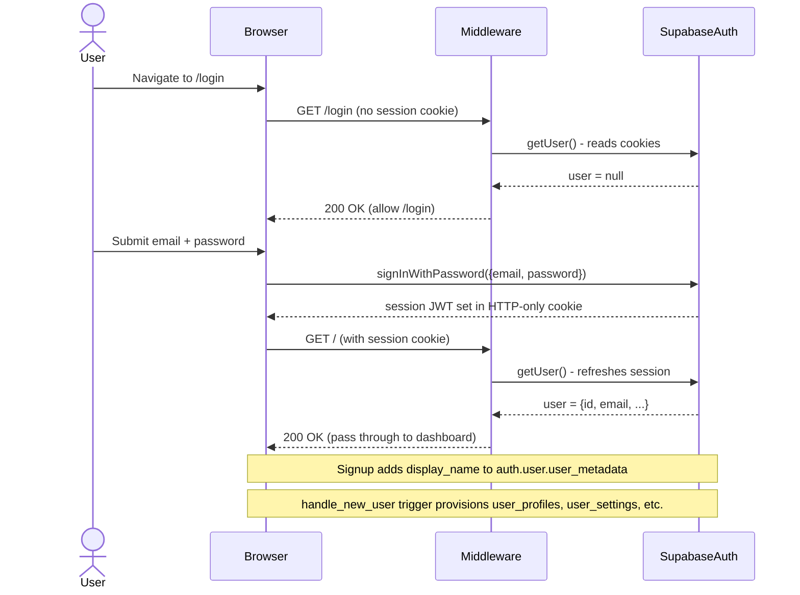

# Low-Level Design Document
## Life OS — Personal Operating System Web Application
### Version 2.0 | July 2026

---

## Table of Contents

1. [Introduction](#1-introduction)
2. [System Architecture](#2-system-architecture)
3. [Authentication and Authorization](#3-authentication-and-authorization)
4. [Frontend Architecture](#4-frontend-architecture)
5. [Database Design](#5-database-design)
6. [Module-by-Module Implementation](#6-module-by-module-implementation)
7. [API Routes](#7-api-routes)
8. [Reticle Integration](#8-reticle-integration)
9. [Deployment](#9-deployment)

---

## 1. Introduction

### 1.1 Purpose

This Low-Level Design (LLD) document provides implementation-level detail sufficient for a developer to re-implement Life OS from scratch. It describes every component, data flow, hook, API route, and design pattern discovered in the source code.

### 1.2 Design Goals

1. **Zero Server Round-trips After Initial Load**: All module pages fetch data client-side in `useEffect` to allow instant skeleton rendering.
2. **Type Safety**: All Supabase tables typed in `src/types/database.ts`; TypeScript strict mode enforced.
3. **RLS-First**: All data access uses the anon key + RLS; the service role key appears only in one server route.
4. **Minimal Bundle**: No component library (shadcn, MUI, etc.); only Lucide icons, Recharts, and Framer Motion.
5. **Dark-Mode Default**: All colours are CSS custom properties; theme switching via `data-theme` on `<html>`.

### 1.3 Reference to SRS

All feature IDs (FR-AUTH-001, etc.) referenced in this document are defined in `SRS_LifeOS.md`.

---

## 2. System Architecture

### 2.1 High-Level Architecture

```mermaid
graph TD
    subgraph Browser
        RC[React Client Components]
        SC[Supabase Browser Client]
        CSS[CSS Custom Properties / Tailwind]
    end

    subgraph Next.js on Vercel
        MW[middleware.ts]
        SRC[Server Components - Dashboard Layout]
        API[/api/admin/users route.ts]
        NC[next.config.ts - withReticle wrapper]
    end

    subgraph Supabase Cloud
        AUTH[Auth Service]
        PG[PostgreSQL + RLS]
        REALTIME[Realtime - not used]
    end

    Browser -->|HTTPS requests| MW
    MW -->|createServerClient - anon key| AUTH
    MW -->|redirects| Browser

    SRC -->|createClient server - anon key| PG
    SRC -->|renders| Browser

    RC -->|createBrowserClient - anon key| PG
    RC -->|signIn/signUp/signOut| AUTH

    API -->|createServerClient anon - auth check| AUTH
    API -->|createAdminClient service role key| PG

    AUTH -->|JWT cookie| Browser
```

### 2.2 Deployment

| Component | Platform | Configuration |
|-----------|----------|---------------|
| Next.js App | Vercel | `next build` → Serverless + Edge |
| Database | Supabase Cloud | PostgreSQL 15+, public schema |
| Auth | Supabase Auth | Email+Password; email confirmation on |
| CDN | Vercel Edge Network | Static assets, Next.js Image (unoptimized) |

### 2.3 Tech Stack Matrix

| Package | Version | Role |
|---------|---------|------|
| next | 16.2.1 | App Router SSR framework |
| react | 19.2.4 | UI library |
| react-dom | 19.2.4 | DOM renderer |
| @supabase/supabase-js | ^2.108.2 | Database + Auth client |
| @supabase/ssr | ^0.12.0 | SSR-safe Supabase client factory |
| typescript | ^5 | Type checking |
| tailwindcss | ^4 | Utility-first CSS |
| @tailwindcss/postcss | ^4 | PostCSS integration |
| lucide-react | ^0.577.0 | Icon library |
| date-fns | ^4.1.0 | Date manipulation |
| framer-motion | ^12.38.0 | Animation (imported; limited use observed) |
| recharts | ^3.8.0 | Charting (imported; Brand Hub bar chart uses CSS) |
| zustand | ^5.0.12 | State management (imported; not yet observed in use) |
| class-variance-authority | ^0.7.1 | Variant class helper |
| clsx | ^2.1.1 | Conditional classnames |
| tailwind-merge | ^3.5.0 | Merge Tailwind classes |
| dotenv | ^17.4.2 | Environment variable loading |
| postgres | ^3.4.9 | Direct PostgreSQL client (for seed scripts) |
| @reticlehq/next | ^2.0.0 | Dev: wraps Next.js config |
| @reticlehq/react | ^2.0.0 | Dev: `ReticleDev` component |
| @reticlehq/server | ^2.0.0 | Dev: server-side MCP bridge |

---

## 3. Authentication and Authorization

### 3.1 Supabase Auth Flow



### 3.2 Middleware Chain

**File**: `middleware.ts`

The middleware runs on every request matching the pattern:
```
'/((?!_next/static|_next/image|favicon.ico|.*\\.(?:svg|png|jpg|jpeg|gif|webp)$).*)'
```

**Logic flow**:
1. Create `createServerClient` with anon key; wire cookie read/write to `NextRequest`.
2. Call `supabase.auth.getUser()` — this both validates and refreshes the session.
3. If `user == null` and route is not an auth route → redirect to `/login`.
4. If `user != null` and route is an auth route → redirect to `/`.
5. If `user != null` and route starts with `/admin` → query `user_profiles.role` for the user. If not `'super_admin'` → redirect to `/`.
6. Return `supabaseResponse` (with potentially updated session cookies).

**Key pattern**: The session cookie is set inside `supabaseResponse`, not on the original response. This is the official `@supabase/ssr` pattern for Next.js middleware.

### 3.3 Server vs Client Supabase Client Pattern

| File | Function | Uses | Cookie Access |
|------|----------|------|---------------|
| `src/lib/supabase/client.ts` | `createClient()` | `createBrowserClient(URL, ANON_KEY)` | LocalStorage/Cookie via browser |
| `src/lib/supabase/server.ts` | `async createClient()` | `createServerClient(URL, ANON_KEY, {cookies})` | Next.js `cookies()` from `next/headers` |
| `middleware.ts` | inline | `createServerClient(URL, ANON_KEY, {cookies on request})` | NextRequest.cookies |
| `src/app/api/admin/users/route.ts` | two clients | SSR anon client (auth check) + `createClient` service role (admin.listUsers) | next/headers cookies |

**Browser client** (`createBrowserClient`): Used in all `'use client'` components. Called via `const supabase = createClient()` inside `useEffect` or event handlers. Never stored in module scope to avoid SSR hydration issues.

**Server client** (`createServerClient`): Used in `src/app/(dashboard)/layout.tsx` (server component) to fetch user profile and enabled modules. The `setAll` cookie handler catches and ignores errors when called from a server component context (cookies can only be set in middleware or route handlers).

### 3.4 Super Admin Role Check

Two independent checks exist:

**Server-side (middleware)**: Queries `user_profiles.role` from Supabase for any request to `/admin/*`. If role is not `'super_admin'`, redirects to `/`.

**Client-side (dashboard layout + admin page)**:
- In `src/app/(dashboard)/layout.tsx` (server component): `isAdmin={profile?.role === 'super_admin'}` passed to Sidebar.
- In `src/app/(dashboard)/admin/page.tsx`: fetches the caller's own `user_profiles.role`; `if (ownProfile?.role !== 'super_admin') { router.push('/'); return }`.

All four call sites (middleware, dashboard layout, admin page, `/api/admin/users`) now read the same `user_profiles.role` column — there is no separate env-var-based check. This dual (server + client) check still ensures the Admin Panel is inaccessible even if middleware is somehow bypassed, but both checks now agree by construction, not by coincidence.

### 3.5 RLS Policy Pattern

All tables in the public schema should have policies following this pattern:

```sql
-- Enable RLS
ALTER TABLE public.table_name ENABLE ROW LEVEL SECURITY;

-- SELECT
CREATE POLICY "Users can view own data" ON public.table_name
  FOR SELECT USING (auth.uid() = user_id);

-- INSERT
CREATE POLICY "Users can insert own data" ON public.table_name
  FOR INSERT WITH CHECK (auth.uid() = user_id);

-- UPDATE
CREATE POLICY "Users can update own data" ON public.table_name
  FOR UPDATE USING (auth.uid() = user_id);

-- DELETE
CREATE POLICY "Users can delete own data" ON public.table_name
  FOR DELETE USING (auth.uid() = user_id);
```

For `user_profiles` and `brand_profile_checklist` where PK = `user_id`, the policy uses `auth.uid() = id` (not `user_id`).

The database also exposes:
```sql
-- Admin-only function
CREATE FUNCTION public.is_super_admin() RETURNS boolean AS $$
  SELECT role = 'super_admin' FROM user_profiles WHERE id = auth.uid()
$$ LANGUAGE sql SECURITY DEFINER;
```

---

## 4. Frontend Architecture

### 4.1 App Router Layout Hierarchy

```
src/app/
├── layout.tsx              (Root layout — html, body, Reticle wrapper)
├── globals.css             (CSS custom properties + utility classes)
├── (auth)/
│   ├── login/page.tsx      ('use client' — login form)
│   └── signup/page.tsx     ('use client' — signup form)
│   └── layout.tsx          [NEEDS CLARIFICATION — auth group layout]
└── (dashboard)/
    ├── layout.tsx           (Server component — fetches profile+modules; renders Sidebar+TopBar)
    ├── page.tsx             ('use client' — dashboard home)
    ├── today/page.tsx       ('use client' — today view)
    ├── day/[number]/page.tsx [NEEDS CLARIFICATION — likely re-renders TodayContent]
    ├── calendar/page.tsx
    ├── progress/page.tsx
    ├── timetable/page.tsx
    ├── goals/page.tsx
    ├── health/page.tsx
    ├── finance/page.tsx
    ├── crm/page.tsx
    ├── blog/page.tsx
    ├── content/page.tsx
    ├── learning/page.tsx
    ├── freelance/page.tsx
    ├── rentlyf/page.tsx
    ├── habits/page.tsx
    ├── brand/page.tsx
    ├── prompt/page.tsx
    ├── settings/page.tsx
    └── admin/page.tsx
```

### 4.2 Dashboard Layout: Server Component Pattern

`src/app/(dashboard)/layout.tsx` is an **async server component**. On every navigation within the dashboard group:

1. `const supabase = await createClient()` — creates SSR Supabase client
2. `supabase.auth.getUser()` — verifies session; redirects to `/login` if null
3. Three parallel Supabase queries via `Promise.all`:
   - `user_profiles` — for `display_name` and `role`
   - `user_module_settings` JOIN `modules` — for enabled modules ordered by `sort_order`
   - `user_settings` — for `theme`
4. Theme injection via inline `<script>` tag (sets `data-theme` before hydration)
5. Renders: `<Sidebar>` (with modules, displayName, isAdmin), `<TopBar>`, `<ToastProvider>`, `{children}`

**Module loading SQL** (via Supabase JS join syntax):
```
user_module_settings
  .select('is_enabled, modules(id, name, slug, icon, sort_order)')
  .eq('user_id', user.id)
  .eq('is_enabled', true)
  .order('modules(sort_order)')
```

### 4.3 Sidebar Module Rendering

`src/components/layout/sidebar.tsx` is a **client component** (needs `usePathname`).

**`SLUG_HREF` map** (hardcoded): Maps each module slug to its path. `timetable` → `/timetable`, etc.

**`ICON_MAP`** (hardcoded): Maps Lucide icon name strings to the actual component. The `modules.icon` column stores the string name (e.g., `"LayoutDashboard"`); the sidebar looks it up: `ICON_MAP[mod.icon ?? ''] ?? LayoutDashboard`.

**Active state**: `pathname === href || (href !== '/' && pathname.startsWith(href)) || (mod.slug === 'today' && pathname.startsWith('/day/'))` — the last condition ensures `/day/42` highlights the "Today" nav item.

**Admin link**: Rendered separately below the module list, conditionally on `isAdmin` prop. Uses `ShieldCheck` icon; amber highlight colour `#FDCB6E`.

### 4.4 CSS Design System

Defined in `src/app/globals.css`. All colours are CSS custom properties applied to `:root`:

```css
:root {
  --bg: #0A0A0F;           /* Page background */
  --surface: #14141F;      /* Card background */
  --surface-hover: #1E1E2E; /* Input background, hover states */
  --accent: #6C5CE7;       /* Purple — primary action colour */
  --success: #00B894;      /* Green */
  --warning: #FDCB6E;      /* Amber/yellow */
  --danger: #FF6B6B;       /* Red */
  --text: #E2E8F0;         /* Primary text */
  --text-muted: #64748B;   /* Secondary text */
  --border: #2D2D3F;       /* Border colour */
}
```

**Utility classes** defined in `globals.css` (not Tailwind; CSS only):

| Class | Usage |
|-------|-------|
| `.card` | `background: var(--surface); border: 1px solid var(--border); border-radius: 12px; padding: 1.25rem` |
| `.badge` | Pill-shaped inline flex label |
| `.label` | `font-size: 11px; uppercase; letter-spacing: 0.05em; color: var(--text-muted)` |
| `.input` | `background: var(--surface-hover); border: 1px solid var(--border); border-radius: 8px` |
| `.btn-primary` | `background: var(--accent); color: #fff; border-radius: 8px` |
| `.btn-ghost` | `background: transparent; border: 1px solid var(--border)` |

Theme switching: `document.documentElement.setAttribute('data-theme', theme)` sets `data-theme` on `<html>`. CSS can target `[data-theme="light"]` for overrides (though light theme variable overrides are not yet defined in `globals.css` — this is `[NEEDS CLARIFICATION]`).

### 4.5 Common UI Patterns

**Toast notifications**: `useToast()` hook from `src/components/ui/toast.tsx`. Called as `show('message', 'success' | 'error')`. Rendered inside `<ToastProvider>` in dashboard layout.

**Loading state**: Every module page initialises `const [loading, setLoading] = useState(true)`. While loading, a centred `<Loader2 size={32} className="animate-spin">` is rendered. No skeleton loaders.

**Empty cycle**: `<EmptyCycle />` component from `src/components/ui/empty-cycle.tsx` rendered when no active cycle exists.

**Confirmation dialogs**: Uses browser-native `confirm('Delete this X?')` before destructive operations.

**Inline forms**: Edit forms are rendered inline (replacing the card they belong to) rather than in modals. Toggle with `editingId` state.

### 4.6 Data Loading Pattern Per Page

All dashboard module pages follow this identical pattern:

```typescript
'use client'
// 1. Component declares state
const [data, setData] = useState([])
const [loading, setLoading] = useState(true)
const [userId, setUserId] = useState(null)

// 2. useEffect loads data
useEffect(() => {
  async function load() {
    const supabase = createClient()                     // browser client
    const { data: { user } } = await supabase.auth.getUser()
    if (!user) { setLoading(false); return }
    setUserId(user.id)

    const { data } = await supabase.from('table')
      .select('*').eq('user_id', user.id)
    setData(data ?? [])
    setLoading(false)
  }
  load()
}, [])

// 3. Mutation functions call createClient() inside the handler
const addItem = async (partial) => {
  const supabase = createClient()
  const { data, error } = await supabase.from('table')
    .insert({...partial, user_id: userId}).select().single()
  if (data) setData(prev => [data, ...prev])
}
```

**Note**: `createClient()` is called fresh inside every mutation handler (not stored in component state). This avoids stale client references.

---

## 5. Database Design

### 5.1 Mermaid ER Diagram

See `SRS_LifeOS.md § 6.1` for the full ER diagram. The LLD focuses on implementation details.

### 5.2 Table-by-Table Detail

#### `ninety_day_cycles` — Cycle Model

Business rules:
- Only one cycle should have `is_active = true` at a time.
- Full import in `/prompt` page: `UPDATE ninety_day_cycles SET is_active = false WHERE user_id = ?` before creating a new cycle.
- Day numbers 1–90; `date = start_date + (day_number - 1)`.
- `end_date = start_date + 89`.

#### `days` — Day Records

Business rules:
- Each day is linked to exactly one cycle via `cycle_id`.
- `day_number` is the human-readable identifier (1–90); used in UI and URL (`/day/42`).
- `rentlyf_hours` is also written to `rentlyf_logs` on update (dual-write in `useDay.updateRentlyfHours`).
- Dates are recalculated on import from the cycle's `start_date`, ignoring AI-provided dates.

#### `tasks` — Task Records

Business rules:
- Grouped by `category` on the Today page.
- `sort_order` determines display order within a category group.
- Valid statuses: `pending → completed | skipped | postponed`.
- Postpone creates a new task on the target day with `status='pending'` and notes prefix `[Postponed from Day N]`, then marks the source task as `postponed`.
- `content` field stores pre-written post body text (copied via Clipboard API on Today page).

#### `timetable_plans` — JSONB Blocks

The `blocks` column is a JSONB array of `TimetableBlock` objects:
```typescript
interface TimetableBlock {
  id: string        // UUID generated client-side (crypto.randomUUID())
  time: string      // Display string: "5:00–9:00 AM"
  emoji: string     // Single emoji character
  name: string      // Block label: "Morning Routine"
  activity: string  // Detail: "Workout, meditation, journalling"
  duration: string  // Text: "4 hours"
  fixed?: boolean   // If true, block cannot be deleted/reordered
}
```

`effective_from` enables versioning: a new plan row with a later `effective_from` date supersedes the current plan.

#### `user_settings` — JSONB weekly_review_checks

The `weekly_review_checks` JSONB stores:
```json
{
  "week": "2026-W28",
  "checks": {
    "completion_rate": true,
    "goal_progress": false,
    "crm_pipeline": true,
    ...
  }
}
```
The `week` field uses `YYYY-W##` format from `date-fns` `getYear()` and `getISOWeek()`. On load, if the stored `week` doesn't match the current ISO week, the checks are treated as empty (client-side reset; not written back until toggled).

#### `brand_profile_checklist` — JSONB

Primary key is `user_id`. The `checklist` field stores:
```json
{
  "photo": true,
  "banner": false,
  "headline": true,
  ...
}
```
Saves via `upsert` on `user_id` conflict.

#### `brand_daily_actions` — Composite PK

Primary key: `(user_id, date)`. The `actions_done` JSONB:
```json
{
  "founder_comments": true,
  "dev_comments": false,
  "connections": true,
  "replies": false,
  "analytics": true
}
```
Client-side reset: if `actionDate !== today`, the form resets `dailyActions = {}` before saving.

#### `health_logs` — Upsert on user_id,date

One row per user per day. Save uses `.upsert(payload, { onConflict: 'user_id,date' })`. The `mood` field is an integer 1–5 mapped to emoji `['', '😞', '😕', '😐', '🙂', '😄']`.

### 5.3 Key Database Patterns

#### `handle_new_user` Trigger

This trigger must fire on `INSERT` to `auth.users` and should:
1. Insert a row into `user_profiles` with `id = NEW.id`, `display_name = NEW.raw_user_meta_data->>'display_name'`.
2. Insert a row into `user_settings` with `user_id = NEW.id` and all defaults.
3. Insert three rows into `timetable_plans` (plan_type A, B, C) with empty blocks and today's `effective_from`.
4. For each module in the `modules` table where `is_default = true`, insert a row into `user_module_settings` with `is_enabled = true`.

Without this trigger, users land on a broken dashboard.

#### 90-Day Cycle Model

```
ninety_day_cycles (1)
    └── days (90)
            └── tasks (N per day)
```

Every task query goes through: task → day → cycle → user. The `user_id` denormalisation on `tasks` and `days` allows direct RLS without joins: `auth.uid() = user_id`.

#### `timetable_plans` effective_from Versioning

Multiple rows can exist per user per plan_type. The "current" plan is the one with the latest `effective_from` date that is ≤ today. In the current UI implementation, the query is a simple `select('*')` for all plans per user — the page shows all three plan types but does not implement date-based version filtering at the query level. This is a simplification.

### 5.4 JSONB Fields Summary

| Table | Column | Type | Shape |
|-------|--------|------|-------|
| timetable_plans | blocks | jsonb | `TimetableBlock[]` |
| user_settings | weekly_review_checks | jsonb | `{week: string, checks: Record<string, bool>}` |
| brand_profile_checklist | checklist | jsonb | `Record<string, bool>` |
| brand_daily_actions | actions_done | jsonb | `Record<string, bool>` |

---

## 6. Module-by-Module Implementation

### 6.1 Dashboard Home (`/`)

**Tables**: `ninety_day_cycles`, `days` + `tasks` (join), `finance_entries`, `health_logs`

**Data load**: Single `useEffect` loads all data sequentially: cycle → days with tasks → month income (filtered by `type='income'` and `date >= startOfMonth`) → exercise days this week (filtered by `exercise_done=true` and `date` in Mon–Sun range).

**Key derivations**:
- `currentDay = differenceInCalendarDays(new Date(), parseISO(cycle.start_date)) + 1`, clamped 1–90.
- Streak: iterate `days` sorted by `day_number DESC`; break on first day with <50% completion or no tasks.
- This-week grid: days where `day_number >= weekStart && day_number < weekStart + 7` where `weekStart = Math.floor((currentDay - 1) / 7) * 7 + 1`.
- 90-day heatmap: `days` array mapped to 7px-wide coloured bars; missing days filled with grey.

### 6.2 Today View (`/today` and `/day/[number]`)

**Tables**: `ninety_day_cycles`, `days` + `tasks` (join), `rentlyf_logs`

**Hooks**: `useActiveCycle` resolves `currentDay`; `useDay(dayNumber, cycleId)` loads the specific day.

**`useDay` hook details**:
- Uses `useRef` to mirror `day` state, preventing stale closures in `toggleTask` (important for rapid clicking).
- `loadDay`: if no `cycleId` provided, fetches the active cycle ID first (stored in `cycleIdRef`).
- Returns: `day, loading, userId, resolvedCycleId, toggleTask, skipTask, editTask, deleteTask, addTask, updateNotes, updateRentlyfHours, postponeTask, reload`.
- Task query: `days.select('*, tasks(*)').eq('cycle_id', cId).eq('day_number', dayNumber).single()`.
- Tasks sorted by `sort_order` after load.

**Notes debounce**: `setTimeout` of 500ms in `onChange`; previous timer cleared on each keystroke.

**Rentlyf dual-write**: `updateRentlyfHours` writes to both `days.rentlyf_hours` and `rentlyf_logs` (upsert on `user_id,date`).

**Category display**: Tasks grouped into `Record<string, Task[]>` using `forEach`. `categoryMeta` hardcoded record maps category slug to `{label, emoji, color}`.

### 6.3 Calendar (`/calendar`)

**Tables**: `ninety_day_cycles`, `days` + `tasks` (join)

Uses `date-fns`: `startOfMonth`, `endOfMonth`, `eachDayOfInterval`, `getDay` (Sunday=0 offset), `isSameDay`, `isSameMonth`.

Calendar initialises `month` state to `new Date(cycle.start_date)` to show the cycle's starting month on first load.

`dayByDate` map: `new Map(days.map(d => [d.date, d]))` for O(1) lookup per calendar cell.

### 6.4 Progress (`/progress`)

**Tables**: `ninety_day_cycles`, `days` + `tasks` (join), `user_settings`

**Two tabs**: "Overview" (KPI cards + charts + weekly review) and "Growth Tracker" (tabular per-day view).

**Weekly breakdown**: Computed client-side from the last 4 complete 7-day blocks relative to `currentDay`.

**Category breakdown**: Aggregated from all `pastDays` task categories into a `Map<string, {done, total}>`, sorted by total, top 8 shown.

**Weekly review**: 6 hardcoded items (IDs: `completion_rate, goal_progress, crm_pipeline, freelance_projects, next_week_content, learning_progress`). State stored in `user_settings.weekly_review_checks` JSONB. Week key = `YYYY-WNN` from `getYear()` + `getISOWeek()`. Saved via `supabase.from('user_settings').update({weekly_review_checks: ...}).eq('user_id', userId)`.

### 6.5 Timetable (`/timetable`)

**Tables**: `timetable_plans`, `timetable_checks`

**Three plan sections**: Loads all `timetable_plans` for user; groups by `plan_type`.

**Block check-offs**: Load `timetable_checks` for today's date (using `getTimetableDay()` which treats pre-5AM as "yesterday"). Toggle updates `block_ids` array via upsert on `user_id,date`.

**Weekly rhythm**: Hardcoded constant `WEEKLY_RHYTHM` (7 objects with day, focus, plan, platform). Not stored in DB.

**Block form**: Generates new block `id` via `crypto.randomUUID()`. Submitting updates the parent plan's `blocks` JSONB array and writes back to Supabase.

**New Cycle button**: Deactivates all cycles, creates a new `ninety_day_cycles` row with today as `start_date` and 89 days later as `end_date`.

### 6.6 Goals (`/goals`)

**Tables**: `goals`

State: `goals: Goal[]`, `activeTab: GoalType`, `adding: boolean`, `editingId: string | null`.

**Toggle logic**:
```typescript
const newStatus = (goal.status === 'completed')
  ? (goal.target_value ? 'in_progress' : 'not_started')
  : 'completed'
```

Progress bar: `pct = (parseFloat(current_value) / parseFloat(target_value)) * 100`, clamped 0–100.

All goals loaded at once; client-side filtered by `activeTab`.

### 6.7 Health Tracker (`/health`)

**Tables**: `health_logs`

**Blank form factory**: `BLANK_FORM(date)` function returns default form state for a given date. Reduces code duplication between new logs and form reset.

**Upsert pattern**: `supabase.from('health_logs').upsert(payload, { onConflict: 'user_id,date' })`.

**Pre-fill**: If today's log exists in loaded data, form auto-populates all fields on mount.

**Date picker**: Selecting a different date auto-populates form from existing log or resets to blank form.

**Summary stats**: Computed from `logs.slice(0, 14)` (most recent 14 records).

### 6.8 Finance Tracker (`/finance`)

**Tables**: `finance_entries`, `user_settings`

Two parallel loads: `finance_entries` (limit 100, desc) and `user_settings` (for `debt_remaining` and `debt_total`).

**Debt payment flow**:
1. Update `user_settings.debt_remaining = Math.max(0, current - paid)`.
2. Insert `finance_entries` record with `category: 'EMI / Debt'`.
3. Optimistically update local state with a temp ID entry.

**Category maps** (hardcoded):
- Income: `['Salary', 'Freelance', 'Rentlyf', 'Investment Returns', 'Other Income']`
- Expense: `['Food', 'Rent', 'Transport', 'Utilities', 'Entertainment', 'Health', 'Education', 'Shopping', 'EMI / Debt', 'Other']`

### 6.9 CRM (`/crm`)

**Tables**: `crm_leads`, `cold_calls`

Two separate state machines on the same page:
- `CrmPage`: manages `crm_leads` with stage filter
- `ColdCallLog` (sub-component): manages `cold_calls` with optional `lead_id` FK

**Pipeline value**: `leads.filter(l => !['lost','client'].includes(l.stage)).reduce((s,l) => s + (l.deal_value ?? 0), 0)`.

**Stage dropdown inline**: Each lead card has a `<select>` for stage that calls `updateLead(id, {stage})` on change.

**Overdue detection**: `lead.next_followup && new Date(lead.next_followup) < new Date()` → shows amber warning badge.

**Cold call lead link**: Selecting a lead auto-fills `name` and `phone` from the leads array.

### 6.10 Blog Manager (`/blog`)

**Tables**: `content_posts` (filtered)

Filters: `.in('platform', ['blog', 'hashnode', 'dev.to', 'medium', 'personal'])`. Shares `content_posts` table with the Content Hub; the platform filter differentiates them.

Fields available in form: `title, platform, status, content (outline), url, scheduled_date`. Does not use `hook`, `tags`, or `pillar` fields (those are used by Content Hub).

### 6.11 Content Hub (`/content`)

**Tables**: `content_posts`

Platforms: `linkedin, twitter, instagram, youtube, newsletter`.

**Weekly calendar view**: `addDays(startOfWeek(currentWeekStart), i)` for each of 7 days. Posts filtered by `scheduled_date` within the week.

**Content pillars**: 8 hardcoded objects `{slug, name, color}`. Pillar stored as string in `content_posts.pillar`.

**Post modal**: Full-screen modal form with all content post fields including `hook`, `tags`, `pillar`.

**URL param**: `/content?pillar={slug}` auto-filters posts to the specified pillar (sourced from Brand Hub links).

### 6.12 Learning Resources (`/learning`)

**Tables**: `learning_resources`

Resource types: `['course', 'book', 'tutorial', 'documentation', 'video', 'podcast', 'other']`.

`total_lessons` and `completed_lessons` are stored as `string | null` (per DB type); parsed as `float` for progress calculation.

"Currently Learning" section shown only when `inProgress.length > 0`.

### 6.13 Freelance Projects (`/freelance`)

**Tables**: `freelance_projects`

**Payment progress**: `paidPct = (paid_amount / budget) * 100`, clamped 0–100. Shown only when `budget > 0`.

**Total earned**: Sum of `paid_amount` for `status='completed'` projects.

**Active pipeline**: Sum of `budget` for `status='active'` projects.

Currencies stored as string; display always uses `₹` symbol regardless of stored currency value.

### 6.14 Rentlyf Log (`/rentlyf`)

**Tables**: `rentlyf_logs`

**Upsert**: One log per user per day (conflict on `user_id,date`). Writing rentlyf hours from the Today page also upserts to this table.

**Week grouping**: Client-side: for each log, compute week start via `setDate(d.getDate() - d.getDay())` (Sunday start).

**This week**: Logs where `(now - date) / 86400000 >= 0 && < 7`.

### 6.15 Habits Tracker (`/habits`)

**Tables**: `habits`, `habit_logs`

**7-day grid**: `Array.from({length: 7}, (_, i) => format(subDays(new Date(), 6 - i), 'yyyy-MM-dd'))` — last 7 days from 6 days ago through today.

**Two separate loads**:
- Initial: `habits` (ordered by `sort_order, created_at`) + `habit_logs` (last 7 days only).
- Streak calculation requires full history: second `useEffect` (depends on `[userId, logs]`) loads `habit_logs` where `done=true` ordered by date DESC.

**Optimistic toggle**: Immediately updates local `logs` state; reverts on Supabase error.

**Upsert**: `habit_logs.upsert({user_id, habit_id, date, done}, { onConflict: 'habit_id,date' })`.

**Streak algorithm**: Walk backwards from today; if not done today, start from yesterday. Break on first gap.

### 6.16 Brand Hub (`/brand`)

**Tables**: `brand_metrics`, `brand_profile_checklist`, `brand_daily_actions`, `content_posts` (pillar count)

**Four parallel loads on mount**: `Promise.all([profile_checklist, daily_actions (today), brand_metrics (limit 20, desc), content_posts (pillar field only)])`.

**Metrics upsert**: `brand_metrics.upsert(data, { onConflict: 'user_id,week_of' })`.

**Follower growth chart**: Pure CSS bar chart; bar height = `(followers / maxFollowers) * 100%`. Does not use Recharts.

**Pillar counts**: `content_posts` response is a minimal `{pillar}` projection; aggregated into `Record<string, number>` client-side.

### 6.17 Prompt & Import (`/prompt`)

**Tables**: `ninety_day_cycles`, `days`, `tasks`

**Three-step wizard** using `step: 1 | 2 | 3` state:
- Step 1: Display prompt template (full or chunk); copy button.
- Step 2: Instructions for AI interaction.
- Step 3: Paste JSON + import.

**Two prompt templates** (hardcoded strings):
- `PROMPT_FULL`: Requests all 90 days in `{cycle, days[]}` format.
- `PROMPT_CHUNK(start, end)`: Requests a range of days in `{days[]}` format.

**Import algorithm**:
```
1. Strip ```json fences from input
2. JSON.parse()
3. If !parsed.cycle (chunk mode) OR appendMode → APPEND path
4. APPEND: find active cycle; verify no duplicate day_numbers; batch insert days + tasks (batch=10)
5. FULL: deactivate all cycles; create new cycle; batch insert days + tasks (batch=10)
6. Dates recalculated: addDays(cycleStart, day_number - 1)
```

`addDays(dateStr, n)`: local function that adds N days to a date string using `Date.setDate()`.

### 6.18 Admin Panel (`/admin`)

**Tables**: `user_profiles`, `modules`, `user_module_settings`
**API**: `/api/admin/users` for email resolution

**Module toggle**: `user_module_settings.upsert({user_id, module_id, is_enabled: !current}, { onConflict: 'user_id,module_id' })`.

**`isEnabled` logic**: Check `settings` array for the `{user_id, module_id}` pair; if not found, fall back to `module.is_default`.

**Bulk enable/disable**: `upsert(Array.from(selected).map(uid => ({user_id: uid, module_id: bulkMod, is_enabled: true})), ...)`.

### 6.19 Settings (`/settings`)

**Tables**: `user_profiles`, `user_settings`
**Auth**: `supabase.auth.updateUser({password})` for password change.

**Immediate theme apply**: `document.documentElement.setAttribute('data-theme', value)` on radio change — applies theme immediately in the browser without a page reload or server round-trip.

**Parallel load**: `Promise.all([user_profiles.select(), user_settings.select()])`.

---

## 7. API Routes

### 7.1 `GET /api/admin/users`

**File**: `src/app/api/admin/users/route.ts`

**Purpose**: Return all auth user IDs and emails to the Admin Panel. This data is only available via the Supabase Admin API (requires service role key), which must not be exposed to the browser.

**Authentication**:
1. Create a server-side anon client from cookies.
2. Call `getUser()` — if not authenticated, return `401 Unauthorized`.
3. Query `user_profiles.role` for the caller; if not `'super_admin'`, return `403 Forbidden`.

**Admin query**:
```typescript
const adminSupabase = createClient(URL, SERVICE_ROLE_KEY, {
  auth: { autoRefreshToken: false, persistSession: false }
})
const { data } = await adminSupabase.auth.admin.listUsers({ perPage: 1000 })
```

**Response**: `{ users: [{ id: string, email: string }] }` — minimal projection, no other sensitive fields.

**Error handling**:
- Missing `SUPABASE_SERVICE_ROLE_KEY`: returns `500` with error message.
- `adminSupabase.auth.admin.listUsers` error: returns `500` with error message.

---

## 8. Reticle Integration

### 8.1 Overview

Reticle (`@reticlehq/*`) is a developer AI testing toolkit wired in as a development-mode overlay.

### 8.2 `next.config.ts` Wrapper

```typescript
import { withReticle } from "@reticlehq/next";

const nextConfig: NextConfig = {
  images: { unoptimized: true },
};

export default withReticle(nextConfig);
```

`withReticle` wraps the Next.js config to inject Reticle's webpack transforms and route handlers.

### 8.3 `ReticleDev` Component

`@reticlehq/react` provides a `ReticleDev` React component. Based on the dependency presence, it is expected to be rendered in the root layout (`src/app/layout.tsx`) gated behind a dev-only condition such as `process.env.NODE_ENV === 'development'`. `[NEEDS CLARIFICATION: exact placement of ReticleDev not confirmed by code read]`.

### 8.4 MCP Bridge

Reticle uses `.mcp.json` for its Model Context Protocol bridge configuration, enabling AI-assisted testing via a local MCP server. The `.commandcode/` directory visible in `git status` may contain Reticle-related configuration.

### 8.5 Dev-Only Guard

The Reticle overlay must never appear in production. The standard pattern is:
```typescript
{process.env.NODE_ENV === 'development' && <ReticleDev />}
```

---

## 9. Deployment

### 9.1 Required Environment Variables

| Variable | Where Set | Value Example |
|----------|-----------|---------------|
| `NEXT_PUBLIC_SUPABASE_URL` | Vercel Environment + `.env.local` | `https://abcdefgh.supabase.co` |
| `NEXT_PUBLIC_SUPABASE_ANON_KEY` | Vercel Environment + `.env.local` | `eyJhbGci...` |
| `SUPABASE_SERVICE_ROLE_KEY` | Vercel Environment only (never in `.env.local` committed to git) | `eyJhbGci...` |

There is no admin-email environment variable. Super admin status is entirely database-driven via `user_profiles.role` — see §3.4.

### 9.2 Vercel Configuration

- Framework preset: Next.js
- Build command: `next build` (implicit)
- Output: `.next` directory
- Node version: compatible with Next.js 16.2.1 (Node 18+)
- `images.unoptimized: true` in `next.config.ts` — no Vercel image optimisation endpoint used

### 9.3 Supabase Setup Checklist

1. Create Supabase project.
2. Run `supabase/complete-database-setup.sql` once, in a fresh project, to create the baseline schema (tables, enums, RLS, `handle_new_user` trigger, `is_super_admin()`/`set_super_admin()` functions, seeded `modules` rows).
3. Run every file in `supabase/migrations/` **in filename order** (`003_...` → `004_...` → `005_...` → ...) — each is idempotent (`IF NOT EXISTS` / `ON CONFLICT DO NOTHING`), safe to re-run.
4. Confirm RLS is enabled on every table; policies enforce `auth.uid() = user_id` (or `= id` for `user_profiles`).
5. Enable email confirmation in Supabase Auth settings (Authentication → Providers → Email).
6. Set allowed redirect URLs to include your deployment's `/auth/callback`.
7. Promote yourself to super_admin: `UPDATE user_profiles SET role = 'super_admin' WHERE id = '<your-user-uuid>';` (find the UUID in Authentication → Users).
8. Note `SUPABASE_SERVICE_ROLE_KEY` (Project Settings → API → service_role) for deployment — never commit it.

### 9.4 Local Development

```bash
# Install dependencies
npm install

# Start development server with Turbopack (implied by Next.js 16 default)
npm run dev
```

`.env.local` (gitignored) must contain:
```
NEXT_PUBLIC_SUPABASE_URL=...
NEXT_PUBLIC_SUPABASE_ANON_KEY=...
SUPABASE_SERVICE_ROLE_KEY=...
```
