# Software Requirements Specification
## Life OS — Personal Operating System Web Application
### Version 2.0 | July 2026

---

## Table of Contents

1. [Introduction](#1-introduction)
2. [Overall Description](#2-overall-description)
3. [System Features](#3-system-features)
4. [External Interface Requirements](#4-external-interface-requirements)
5. [Non-Functional Requirements](#5-non-functional-requirements)
6. [Data Requirements](#6-data-requirements)
7. [Appendices](#7-appendices)

---

## 1. Introduction

### 1.1 Purpose

This Software Requirements Specification (SRS) document describes the functional and non-functional requirements for Life OS, a personal productivity and life management web application (version 2). It is intended for the application's developer (Prajjawal Singh), any future contributors, and technical stakeholders who need to understand the system's behaviour, data model, and constraints.

This document follows the IEEE 830-1998 / ISO/IEC/IEEE 29148:2018 structure.

### 1.2 Scope

Life OS is a single-user, full-stack web application that serves as a personal operating system for goal tracking, daily task management, health logging, finance tracking, CRM (client relationship management), content planning, learning management, freelance project tracking, habit building, and LinkedIn brand growth.

The system is built on Next.js 16 (App Router), backed by a Supabase PostgreSQL database with Row Level Security (RLS), and deployed on Vercel. All data belongs to the authenticated user and is inaccessible to any other user by database policy.

The product name as displayed in the application UI is **Life OS v2**.

### 1.3 Definitions, Acronyms, and Abbreviations

| Term | Definition |
|------|-----------|
| RLS | Row Level Security — PostgreSQL policy that restricts data access per user |
| SSR | Server-Side Rendering — Next.js renders HTML on the server before sending to browser |
| Supabase | Open-source Firebase alternative providing PostgreSQL, Auth, and realtime APIs |
| Cycle | A 90-day period tracked in the `ninety_day_cycles` table |
| Day | A single calendar day within a cycle, tracked in the `days` table |
| Task | An actionable item belonging to a Day, tracked in the `tasks` table |
| Plan A / B / C | Three predefined timetable templates representing different daily intensities |
| super_admin | The privileged user role granting access to the Admin Panel |
| Module | A feature area (e.g., Health, Finance, CRM) that can be enabled/disabled per user |
| Slug | A URL-safe string identifier for a module (e.g., `health`, `crm`) |
| Anon Key | Supabase public API key; safe for browser exposure; enforces RLS |
| Service Role Key | Supabase superuser key; server-side only; bypasses RLS |

### 1.4 References

- Next.js 16.2.1 Documentation: https://nextjs.org/docs
- Supabase Docs: https://supabase.com/docs
- @supabase/ssr ^0.12.0: https://github.com/supabase/ssr
- Tailwind CSS v4: https://tailwindcss.com/docs
- Source: `D:\Mine\My projects\MyProjects\MyHelpingHand`
- Type definitions: `src/types/database.ts`

### 1.5 Overview

Section 2 describes the product context. Section 3 covers all functional requirements organised by module, each with stimulus/response sequences, requirement tables, and validation rules. Section 4 covers external interfaces. Section 5 covers non-functional requirements. Section 6 defines the data schema. Section 7 provides appendices including the module registry, environment variables, route map, and glossary.

---

## 2. Overall Description

### 2.1 Product Perspective

Life OS is a self-contained personal productivity application. It is not a multi-tenant SaaS platform — each Supabase account is intended for one primary user. The application replaces or supplements external tools such as Notion, habit trackers, CRM spreadsheets, and content calendars, unifying them in a single dark-mode web interface.

The application interfaces with:
- **Supabase Auth**: email+password authentication with optional email confirmation
- **Supabase PostgreSQL**: all application data stored in the `public` schema with RLS
- **Vercel Edge Network**: deployment and CDN
- **Browser Clipboard API**: used by the Today page for copying post content

### 2.2 Product Functions

Life OS provides the following high-level functional areas:

1. **Authentication** — sign up, sign in, password reset, SSR session management
2. **Dashboard Home** — cycle progress card, 90-day heatmap, streak calculation, quick stats (income, exercise)
3. **Today View** — day tasks grouped by category, task status management, notes, Rentlyf hours log
4. **Calendar** — monthly calendar overlaying cycle days with task completion indicators
5. **Progress** — overall completion metrics, streak, weekly breakdown, category breakdown, weekly review checklist
6. **Timetable** — Plan A/B/C time-block manager with daily check-offs, weekly rhythm display, new cycle trigger
7. **Goals** — life/annual/quarterly/monthly goal CRUD with progress bars
8. **Health Tracker** — daily logs for sleep, water, exercise, yoga, meditation, skincare, mood, weight
9. **Finance Tracker** — income/expense entry, debt countdown, running totals
10. **CRM** — lead pipeline (cold/warm/hot/proposal/client/lost), cold call log
11. **Blog Manager** — content posts filtered to blog platforms (blog, hashnode, dev.to, medium, personal)
12. **Content Hub** — multi-platform post planning (LinkedIn, Twitter, Instagram, YouTube, newsletter) with weekly calendar view and content pillars
13. **Learning** — learning resource tracker (courses, books, tutorials, etc.) with lesson progress
14. **Freelance** — freelance project tracking with budget/payment progress
15. **Rentlyf Log** — coding hours tracker for the Rentlyf side-project, grouped by week
16. **Habits Tracker** — daily/weekly habit tracking with 7-day grid and streak calculation
17. **Brand Hub** — LinkedIn metrics logging, profile checklist, daily actions, content pillar counts
18. **Prompt & Import** — AI-assisted 90-day plan generation with JSON import (full or chunked)
19. **Admin Panel** — user management and per-module enable/disable (super_admin only)
20. **Settings** — profile editing, theme selection, timezone, debt total, password change, sign-out

### 2.3 User Classes

| Class | Description | Access |
|-------|-------------|--------|
| Authenticated User | Any user who has created an account and confirmed their email | All modules enabled by admin |
| Super Admin | User whose `user_profiles.role` is `super_admin` | All modules + Admin Panel |

There is no unauthenticated read access to any application data.

### 2.4 Operating Environment

- **Runtime**: Next.js 16.2.1 on Node.js (Vercel Edge/Serverless)
- **Database**: Supabase PostgreSQL (cloud-hosted)
- **Client**: Any modern web browser with JavaScript enabled (Chrome, Firefox, Safari, Edge)
- **Network**: HTTPS only
- **Theme**: Dark mode default; light and system modes available via Settings

### 2.5 Design Constraints

- All user data must be protected by Supabase Row Level Security policies. Every table in the `public` schema must enforce `auth.uid() = user_id` for SELECT, INSERT, UPDATE, DELETE.
- The `SUPABASE_SERVICE_ROLE_KEY` must never be exposed to the browser. It is used only in server-side API route `src/app/api/admin/users/route.ts`.
- The Next.js App Router is used exclusively; the Pages Router is not used.
- Tailwind CSS v4 with PostCSS is used for styling. No external component libraries are imported.
- Framer Motion ^12.38.0, Recharts ^3.8.0, Lucide React ^0.577.0, date-fns ^4.1.0, and zustand ^5.0.12 are permitted runtime dependencies.

### 2.6 Assumptions and Dependencies

- The Supabase project has the `handle_new_user` trigger installed to auto-provision `user_profiles`, `user_settings`, default `timetable_plans`, and `user_module_settings` on first signup.
- Supabase email confirmation is enabled in the project's Auth settings.
- `user_profiles.role = 'super_admin'` identifies the super_admin; set via `UPDATE user_profiles SET role = 'super_admin' WHERE id = '<user-uuid>'` in the Supabase SQL editor. This is the single source of truth — middleware, the dashboard layout, the Admin Panel page, and `/api/admin/users` all read this same column.
- The `NEXT_PUBLIC_SUPABASE_URL` and `NEXT_PUBLIC_SUPABASE_ANON_KEY` are set in the deployment environment.
- The Reticle dev-testing integration (`@reticlehq/next`, `@reticlehq/react`, `@reticlehq/server`) is active only in development.

---

## 3. System Features

### FR-AUTH: Authentication

#### 3.1.1 Description

The system provides Supabase email+password authentication with server-side session management via HTTP-only cookies. The middleware enforces authentication on all non-auth routes.

#### 3.1.2 Stimulus / Response

| Stimulus | System Response |
|----------|----------------|
| Unauthenticated request to any route except `/login`, `/signup`, `/auth/callback` | Middleware redirects to `/login` |
| Authenticated request to `/login` or `/signup` | Middleware redirects to `/` |
| Authenticated request to `/admin` by non-super_admin | Middleware redirects to `/` |
| User submits valid email + password on login form | `supabase.auth.signInWithPassword()` called; on success, router navigates to `/` |
| User submits invalid credentials | Error message displayed in red panel below the form |
| User clicks "Forgot password?" and submits email | `supabase.auth.resetPasswordForEmail()` called with `redirectTo: .../auth/callback?type=recovery`; success state shows "Check your inbox" |
| New user submits sign-up form with name, email, password ≥8 chars | `supabase.auth.signUp()` called; success state shows "Check your email" |

#### 3.1.3 Functional Requirements

| ID | Description | Priority | Acceptance Criteria |
|----|-------------|----------|---------------------|
| FR-AUTH-001 | The system shall require authentication on all routes except `/login`, `/signup`, and `/auth/callback` | Must | Unauthenticated `GET /` returns redirect to `/login` |
| FR-AUTH-002 | The system shall redirect authenticated users away from auth routes to `/` | Must | Authenticated `GET /login` returns redirect to `/` |
| FR-AUTH-003 | The `super_admin` role check shall occur server-side in middleware for `/admin` routes | Must | Non-admin user cannot access `/admin` even with direct URL |
| FR-AUTH-004 | Password at sign-up must be at least 8 characters | Must | Form validates client-side before calling Supabase |
| FR-AUTH-005 | Password reset email redirects to `/auth/callback?type=recovery` | Should | Valid recovery link in email leads to password update flow |
| FR-AUTH-006 | Session refresh must occur in middleware on every request | Must | `supabase.auth.getUser()` is called in middleware to refresh session cookie |

#### 3.1.4 Data Validation

- Email: valid email format (enforced by `<input type="email">`)
- Password (sign-up): minimum 8 characters, validated client-side before Supabase call
- Display name (sign-up): passed in `options.data.display_name`; optional

#### 3.1.5 Error Scenarios

- Invalid email/password: Supabase returns error; message displayed verbatim
- Email not confirmed: Supabase returns "Email not confirmed" error; displayed to user
- Password reset for unknown email: Supabase sends no email but reports success (security by design)

---

### FR-DASH: Dashboard Home

#### 3.2.1 Description

The dashboard home page (`/`) loads the active `ninety_day_cycles` record, queries all `days` with their `tasks`, computes streak, and loads the month's income total and this week's exercise count as quick stats.

#### 3.2.2 Stimulus / Response

| Stimulus | System Response |
|----------|----------------|
| User navigates to `/` | Page queries Supabase: active cycle, all days+tasks, month income, week exercise |
| No active cycle found | `EmptyCycle` component rendered, prompting user to import a plan |
| Active cycle present | Today's summary card, 4 quick-stat cards, this-week grid, quick-access links, 90-day heatmap |
| User clicks heatmap cell | Navigates to `/day/{day_number}` |

#### 3.2.3 Functional Requirements

| ID | Description | Priority |
|----|-------------|----------|
| FR-DASH-001 | Display current day number, date, plan type badge, tasks done/total | Must |
| FR-DASH-002 | Circular SVG progress ring showing today's task completion % | Must |
| FR-DASH-003 | Streak = consecutive past days with ≥50% task completion | Must |
| FR-DASH-004 | Monthly income stat from `finance_entries` where `type='income'` and `date >= first of month` | Should |
| FR-DASH-005 | Exercise days this week from `health_logs` where `exercise_done=true` and `date` in Mon–Sun range | Should |
| FR-DASH-006 | 90-day heatmap: 90 vertical bars colour-coded green(≥80%), yellow(50–79%), red(<50%), grey(no data/future) | Must |
| FR-DASH-007 | This-week grid showing 7 day cells, each with completion dot | Must |
| FR-DASH-008 | Quick-access links to `/health`, `/finance`, `/crm`, `/prompt` | Should |

---

### FR-TODAY: Today View

#### 3.3.1 Description

The Today page (`/today`) resolves the current day number from the active cycle and renders the full day view. It also serves individual day pages at `/day/[number]` via the `TodayContent` component.

#### 3.3.2 Stimulus / Response

| Stimulus | System Response |
|----------|----------------|
| User navigates to `/today` | `useActiveCycle` hook resolves current day number; `useDay` hook loads day + tasks |
| User clicks task checkbox | `toggleTask()`: updates status between `pending` and `completed` |
| User clicks Skip button | `skipTask()`: sets status to `skipped` |
| User clicks Postpone button | Opens inline postpone UI; on confirm, creates duplicate task on target day with `status=pending` and note `[Postponed from Day N]`; marks source task as `postponed` |
| User edits Rentlyf hours input | `updateRentlyfHours()`: updates `days.rentlyf_hours` and upserts `rentlyf_logs` record |
| User types in notes textarea | 500ms debounced call to `updateNotes()` |
| User adds quick task | `addTask()` inserts with `category='general'` and `sort_order = max + 1` |

#### 3.3.3 Functional Requirements

| ID | Description | Priority |
|----|-------------|----------|
| FR-TODAY-001 | Tasks must be grouped by `category` and displayed with category emoji and completion count | Must |
| FR-TODAY-002 | Completed tasks shown with line-through; skipped tasks shown with [Skipped] prefix | Must |
| FR-TODAY-003 | Tasks with `content` field show a truncated preview (200 chars) with Copy button | Must |
| FR-TODAY-004 | Postpone creates a new task on the target day and marks source as `postponed` | Must |
| FR-TODAY-005 | Notes are auto-saved with 500ms debounce | Must |
| FR-TODAY-006 | Navigation links to previous/next day (Day N-1, Day N+1) bounded to 1–90 | Must |
| FR-TODAY-007 | Rentlyf hours update syncs to both `days` table and `rentlyf_logs` table (upsert on `user_id,date`) | Must |

#### 3.3.4 Task Categories

Valid categories as used in the UI: `linkedin`, `github`, `twitter`, `freelance`, `portfolio`, `blog`, `rentlyf`, `learning`, `networking`, `health`, `personal`, `general`.

---

### FR-CAL: Calendar

#### 3.4.1 Description

Monthly calendar view at `/calendar`. Overlays cycle days on a standard calendar grid, showing task completion dots and navigation to any day view.

#### 3.4.2 Functional Requirements

| ID | Description | Priority |
|----|-------------|----------|
| FR-CAL-001 | Display a 7-column calendar grid for the current month | Must |
| FR-CAL-002 | Colour-code each day cell with a completion dot (green/yellow/red/grey) | Must |
| FR-CAL-003 | Today's cell is highlighted with accent colour ring | Must |
| FR-CAL-004 | Clicking a day cell with data navigates to `/day/{day_number}` | Must |
| FR-CAL-005 | Upcoming-days list shows current day through current day + 6 | Should |
| FR-CAL-006 | Month navigation via chevron buttons | Must |
| FR-CAL-007 | Calendar initialises on cycle start month if a cycle is active | Should |

---

### FR-PROG: Progress

#### 3.5.1 Description

Analytics page at `/progress` providing two tabs: Overview (KPI cards, heatmap, weekly breakdown, category breakdown, last-14-days list, weekly review checklist) and Growth Tracker (per-day table with category breakdowns for LinkedIn, GitHub, Twitter, Freelance).

#### 3.5.2 Functional Requirements

| ID | Description | Priority |
|----|-------------|----------|
| FR-PROG-001 | Streak card: consecutive days with ≥50% completion | Must |
| FR-PROG-002 | Overall completion rate: completed / total tasks across all past days | Must |
| FR-PROG-003 | 90-day heatmap with today highlighted by accent outline | Must |
| FR-PROG-004 | Weekly breakdown for last 4 weeks (horizontal progress bars) | Must |
| FR-PROG-005 | Category breakdown sorted by total task count (top 8 categories) | Should |
| FR-PROG-006 | Weekly review checklist persisted in `user_settings.weekly_review_checks` as JSONB `{week: "YYYY-W##", checks: {}}` | Must |
| FR-PROG-007 | Growth Tracker tab: table rows per past day, columns for LinkedIn/GitHub/Twitter/Freelance done/total | Should |
| FR-PROG-008 | Clicking a Growth Tracker row navigates to `/day/{day_number}` | Should |

---

### FR-TT: Timetable

#### 3.6.1 Description

The timetable page at `/timetable` shows the user's three plan templates (Plan A, B, C), allows editing time blocks, shows today's check-off state, shows the weekly rhythm schedule, and provides a "New Cycle" button.

#### 3.6.2 Stimulus / Response

| Stimulus | System Response |
|----------|----------------|
| Page loads | Loads all three `timetable_plans` for user; loads today's `timetable_checks` |
| User checks a time block | Upserts `timetable_checks` for today's date; `block_ids` array updated |
| User adds/edits a block | Updates `timetable_plans.blocks` JSONB array |
| User clicks "New Cycle" | Deactivates all cycles, creates new `ninety_day_cycles` with today as start date |

#### 3.6.3 Functional Requirements

| ID | Description | Priority |
|----|-------------|----------|
| FR-TT-001 | Display blocks for each of Plan A, B, C in separate sections | Must |
| FR-TT-002 | Blocks stored as JSONB array in `timetable_plans.blocks`; each block has `id, time, emoji, name, activity, duration, fixed` | Must |
| FR-TT-003 | Daily check-off stored in `timetable_checks`: `date, block_ids[]` | Must |
| FR-TT-004 | `effective_from` field on `timetable_plans` allows versioning | Should |
| FR-TT-005 | Weekly rhythm table shows Mon–Sun with focus, plan type, and platform | Must |
| FR-TT-006 | Time before 5:00 AM treats the date as "yesterday" (night-shift guard) | Must |

---

### FR-GOALS: Goals

#### 3.7.1 Description

Goal tracking at `/goals` supporting four goal types: `life`, `annual`, `quarterly`, `monthly`. Goals have a status, optional numeric target/current/unit fields, and a deadline.

#### 3.7.2 Functional Requirements

| ID | Description | Priority |
|----|-------------|----------|
| FR-GOALS-001 | Tab bar filters goals by type; count badge per tab | Must |
| FR-GOALS-002 | GoalCard shows progress bar when `target_value` is numeric | Must |
| FR-GOALS-003 | Toggle button cycles status: if completed → in_progress (if numeric target) or not_started (if no target) | Must |
| FR-GOALS-004 | Title is required; all other fields optional | Must |
| FR-GOALS-005 | Deadline displayed in locale format `dd MMM yyyy` | Should |
| FR-GOALS-006 | CRUD: create, read, update, delete with confirmation on delete | Must |

#### 3.7.3 Validation

- `title`: required, non-empty string
- `goal_type`: one of `life | annual | quarterly | monthly`
- `status`: one of `not_started | in_progress | completed | on_hold`
- `target_value`, `current_value`: stored as `string | null` in DB; parsed as float for progress calculation

---

### FR-HEALTH: Health Tracker

#### 3.8.1 Description

Daily health logging at `/health`. One record per user per date, upserted on `user_id,date`. Shows summary stats for last 14 days.

#### 3.8.2 Functional Requirements

| ID | Description | Priority |
|----|-------------|----------|
| FR-HEALTH-001 | Form supports: weight_kg, water_glasses, sleep_hours, exercise_done, yoga_done, meditation_done, skincare_done, exercise_minutes, exercise_notes, mood (1–5), notes | Must |
| FR-HEALTH-002 | Save uses `upsert` on `user_id,date` conflict | Must |
| FR-HEALTH-003 | Mood uses range slider (1–5) with emoji indicators | Must |
| FR-HEALTH-004 | Pre-fills form from today's existing log on page load | Must |
| FR-HEALTH-005 | History table shows last 14 logs with inline edit (scroll-to-top pattern) | Must |
| FR-HEALTH-006 | Summary cards: avg sleep (14d), avg water (14d), exercise days + minutes (14d), meditation days (14d) | Must |
| FR-HEALTH-007 | Loads last 90 days of logs | Should |

---

### FR-FIN: Finance Tracker

#### 3.9.1 Description

Income and expense tracking at `/finance`. Supports filtering, running totals, and a debt countdown widget that updates `user_settings.debt_remaining`.

#### 3.9.2 Functional Requirements

| ID | Description | Priority |
|----|-------------|----------|
| FR-FIN-001 | Entry fields: date, type (income/expense), category, description, amount, currency | Must |
| FR-FIN-002 | Categories: income: [Salary, Freelance, Rentlyf, Investment Returns, Other Income]; expense: [Food, Rent, Transport, Utilities, Entertainment, Health, Education, Shopping, EMI / Debt, Other] | Must |
| FR-FIN-003 | Summary: total income, total expense, net balance (all entries loaded) | Must |
| FR-FIN-004 | Debt countdown: reads/writes `user_settings.debt_remaining` and `debt_total`; logging a payment creates `finance_entries` record with category `EMI / Debt` | Must |
| FR-FIN-005 | Filter bar: All / Income / Expense | Must |
| FR-FIN-006 | Loads last 100 entries ordered by date descending | Should |
| FR-FIN-007 | Currency defaults to `INR`; displayed with `₹` symbol | Must |
| FR-FIN-008 | Amount must be positive float; validated before save | Must |

---

### FR-CRM: CRM

#### 3.10.1 Description

Lead pipeline management at `/crm` with stages: `cold → warm → hot → proposal → client → lost`. Includes a cold call log sub-component.

#### 3.10.2 Functional Requirements

| ID | Description | Priority |
|----|-------------|----------|
| FR-CRM-001 | Lead pipeline kanban summary: 6 stage columns each showing lead count | Must |
| FR-CRM-002 | Stage filter: clicking a stage filters the list; clicking again deselects | Must |
| FR-CRM-003 | Lead fields: name (required), company, email, phone, stage, service, deal_value, source, next_followup, notes | Must |
| FR-CRM-004 | Overdue follow-up indicator when `next_followup` is in the past | Must |
| FR-CRM-005 | Inline stage dropdown on each lead card | Must |
| FR-CRM-006 | Pipeline value = sum of `deal_value` for non-lost, non-client leads | Should |
| FR-CRM-007 | Cold Call Log: date, name, phone, outcome, notes, optional `lead_id` link | Must |
| FR-CRM-008 | Outcome options: no_answer, callback, interested, not_interested, converted | Must |
| FR-CRM-009 | Selecting a lead in cold call form pre-fills name and phone | Should |

---

### FR-BLOG: Blog Manager

#### 3.11.1 Description

Content post manager at `/blog` filtered to platforms `blog, hashnode, dev.to, medium, personal`. Uses the shared `content_posts` table.

#### 3.11.2 Functional Requirements

| ID | Description | Priority |
|----|-------------|----------|
| FR-BLOG-001 | Filter posts where `platform IN ('blog','hashnode','dev.to','medium','personal')` | Must |
| FR-BLOG-002 | Status pipeline: idea → draft → scheduled → published | Must |
| FR-BLOG-003 | Fields: title (required), platform, status, content/outline, URL, scheduled_date | Must |
| FR-BLOG-004 | Published URL shown as external link with icon | Should |
| FR-BLOG-005 | Status count badges in filter bar | Should |

---

### FR-CONTENT: Content Hub

#### 3.12.1 Description

Multi-platform content calendar at `/content` with weekly view and 8 content pillars. Platforms: linkedin, twitter, instagram, youtube, newsletter.

#### 3.12.2 Functional Requirements

| ID | Description | Priority |
|----|-------------|----------|
| FR-CONTENT-001 | Weekly calendar view: Mon–Sun columns with posts scheduled per day | Must |
| FR-CONTENT-002 | Platform tabs filter the weekly view | Must |
| FR-CONTENT-003 | Content pillars: backend, startup, rentlyf, learning, product, career, docs, business | Must |
| FR-CONTENT-004 | Post fields: title, platform, status, content, hook, tags, pillar, scheduled_date, URL | Must |
| FR-CONTENT-005 | Copy-to-clipboard button for post content | Should |
| FR-CONTENT-006 | Pillar field (stored in `content_posts.pillar`) links to Brand Hub pillar counts | Must |

---

### FR-LEARN: Learning Resources

#### 3.13.1 Description

Learning resource tracker at `/learning` supporting types: course, book, tutorial, documentation, video, podcast, other. Tracks lesson progress.

#### 3.13.2 Functional Requirements

| ID | Description | Priority |
|----|-------------|----------|
| FR-LEARN-001 | "Currently Learning" section for `status=in_progress` resources with progress bars | Must |
| FR-LEARN-002 | Fields: title (required), resource_type, topic, status, url, notes, total_lessons, completed_lessons | Must |
| FR-LEARN-003 | Progress bar = completed_lessons / total_lessons × 100 | Should |
| FR-LEARN-004 | Status filter: all / not_started / in_progress / completed / on_hold | Must |
| FR-LEARN-005 | URL displayed as external link | Should |

---

### FR-FREE: Freelance Projects

#### 3.14.1 Description

Freelance project tracker at `/freelance` with pipeline stages and payment tracking.

#### 3.14.2 Functional Requirements

| ID | Description | Priority |
|----|-------------|----------|
| FR-FREE-001 | Project fields: title (required), client_name, platform, status, budget, paid_amount, currency, deadline, notes | Must |
| FR-FREE-002 | Platforms: Upwork, Fiverr, LinkedIn, Direct, Referral, Other | Should |
| FR-FREE-003 | Status pipeline: lead → proposal → active → completed → cancelled | Must |
| FR-FREE-004 | Payment progress bar: paid_amount / budget | Must |
| FR-FREE-005 | Summary: total earned (completed projects), active pipeline value (active projects), active project count | Must |
| FR-FREE-006 | Currency defaults to `INR`; displayed with `₹` | Must |

---

### FR-RENT: Rentlyf Log

#### 3.15.1 Description

Dedicated coding hours tracker at `/rentlyf` for the Rentlyf side-project. Upserts on `user_id,date`. Grouped by week.

#### 3.15.2 Functional Requirements

| ID | Description | Priority |
|----|-------------|----------|
| FR-RENT-001 | Fields: date, hours (0–24 step 0.5), category (dashboard/development/design/meeting/support/other), notes | Must |
| FR-RENT-002 | Save uses upsert on `user_id,date` (one log per day) | Must |
| FR-RENT-003 | Summary: total hours all time, this week (last 7 days), daily average | Must |
| FR-RENT-004 | Logs grouped by calendar week with weekly total | Must |

---

### FR-HABITS: Habit Tracker

#### 3.16.1 Description

Habit tracking at `/habits` with a 7-day grid view and streak calculation.

#### 3.16.2 Functional Requirements

| ID | Description | Priority |
|----|-------------|----------|
| FR-HABITS-001 | Habit fields: name (required), emoji, colour (hex), frequency (daily/weekly) | Must |
| FR-HABITS-002 | 7-day grid: last 7 days as columns; habits as rows; toggle buttons per cell | Must |
| FR-HABITS-003 | Toggle uses upsert on `habit_id,date` | Must |
| FR-HABITS-004 | Optimistic update: UI updates immediately; reverted on error | Must |
| FR-HABITS-005 | Streak = consecutive days (working backwards from today or yesterday) where `done=true` | Must |
| FR-HABITS-006 | Streak displayed in colour-bordered badge using habit's colour | Should |

---

### FR-BRAND: Brand Hub

#### 3.17.1 Description

LinkedIn brand management at `/brand`. Tracks weekly metrics (followers, profile views, search appearances, post impressions, connections), a profile setup checklist, and daily actions. Displays follower growth bar chart and content pillar post counts.

#### 3.17.2 Functional Requirements

| ID | Description | Priority |
|----|-------------|----------|
| FR-BRAND-001 | Weekly metrics fields: followers, connections, profile_views, search_appearances, post_impressions | Must |
| FR-BRAND-002 | Metrics use upsert on `user_id,week_of`; week_of is always a Monday date | Must |
| FR-BRAND-003 | Profile checklist: 11 items; persisted in `brand_profile_checklist.checklist` (JSONB) per user | Must |
| FR-BRAND-004 | Daily actions: 5 items; persisted in `brand_daily_actions.actions_done` (JSONB); keyed by date; resets daily | Must |
| FR-BRAND-005 | Follower growth chart: CSS bar chart of last 8 weeks | Should |
| FR-BRAND-006 | Content pillars: 8 pillars; count derived from `content_posts.pillar`; links to `/content?pillar={slug}` | Must |
| FR-BRAND-007 | Connection growth table shows week-over-week delta | Should |

---

### FR-PROMPT: 90-Day Planner

#### 3.18.1 Description

AI-assisted plan import at `/prompt`. Three-step wizard: copy prompt → get JSON from AI → paste and import. Supports full 90-day import (replaces active cycle) and chunk append mode (adds days to existing cycle).

#### 3.18.2 Stimulus / Response

| Stimulus | System Response |
|----------|----------------|
| User selects "Full 90-Day" prompt | Template shown with bracketed fields; Copy button available |
| User selects "30-Day Chunk" prompt | Chunk prompt with configurable start/end days shown |
| User submits valid JSON (full mode) | Deactivates all current cycles; creates new `ninety_day_cycles`; inserts days and tasks in batches of 10 |
| User submits valid JSON (append mode) | Finds active cycle; validates no duplicate day_numbers; inserts new days + tasks |
| User submits invalid JSON | Error message displayed |
| Import succeeds | Success state shown; router.push('/') after 2 seconds |

#### 3.18.3 Functional Requirements

| ID | Description | Priority |
|----|-------------|----------|
| FR-PROMPT-001 | Strip markdown code fences from JSON before parsing | Must |
| FR-PROMPT-002 | Full mode: deactivate current cycle; create new cycle; insert all days + tasks in batches of 10 | Must |
| FR-PROMPT-003 | Append mode: find active cycle; validate no duplicate day_numbers; insert new days + tasks | Must |
| FR-PROMPT-004 | Dates recalculated from cycle's `start_date` + (`day_number` - 1) regardless of AI-provided dates | Must |
| FR-PROMPT-005 | Start date override UI (full mode only) recalculates all dates before insert | Must |

---

### FR-ADMIN: Admin Panel

#### 3.19.1 Description

User management at `/admin`. Visible only to users whose `user_profiles.role` is `super_admin`. Displays all user profiles with per-module enable/disable toggles.

#### 3.19.2 Functional Requirements

| ID | Description | Priority |
|----|-------------|----------|
| FR-ADMIN-001 | Server-side and client-side guard: if `user_profiles.role !== 'super_admin'`, redirect to `/` | Must |
| FR-ADMIN-002 | User emails fetched from `/api/admin/users` (server route using `SUPABASE_SERVICE_ROLE_KEY`) | Must |
| FR-ADMIN-003 | Module toggle: upsert `user_module_settings` on `user_id,module_id` conflict | Must |
| FR-ADMIN-004 | "Enable All" button: bulk upsert all modules for a user to `is_enabled=true` | Should |
| FR-ADMIN-005 | Bulk select + module select + Enable/Disable for selected users | Should |
| FR-ADMIN-006 | Search by email or display name | Should |

---

### FR-SETTINGS: Settings

#### 3.20.1 Description

User preferences at `/settings`. Allows editing profile, display preferences, finance configuration, password change, and sign-out.

#### 3.20.2 Functional Requirements

| ID | Description | Priority |
|----|-------------|----------|
| FR-SETTINGS-001 | Profile: display_name, bio, linkedin_url, github_url, twitter_url, portfolio_url | Must |
| FR-SETTINGS-002 | Preferences: theme (dark/light/system), timezone, week_start (monday/sunday), daily_reminder_time | Must |
| FR-SETTINGS-003 | Theme change applies immediately to `document.documentElement.setAttribute('data-theme', ...)` | Must |
| FR-SETTINGS-004 | Finance: debt_total configurable; writes to `user_settings.debt_total` | Must |
| FR-SETTINGS-005 | Password change: validates match and min length ≥8 before `supabase.auth.updateUser()` | Must |
| FR-SETTINGS-006 | Sign out calls `supabase.auth.signOut()` then redirects to `/login` | Must |
| FR-SETTINGS-007 | Note: `daily_reminder_time` is saved but in-app push notifications are not yet implemented | `[NEEDS CLARIFICATION]` |
| FR-SETTINGS-008 | Data export: "Export My Data" button (`src/lib/export.ts`) pulls every user-owned table client-side and downloads one JSON file via `Blob` + `URL.createObjectURL` | Should |

---

## 4. External Interface Requirements

### 4.1 User Interfaces

- **Layout**: Fixed 240px left sidebar; main content area with 24px padding
- **Sidebar**: Dark background `#0A0A0F` with `#6C5CE7` (purple) active highlight; module list from DB; user display name at bottom
- **Theme**: CSS variables defined in `src/app/globals.css`; dark by default; switchable via `data-theme` attribute on `<html>`
- **Components**: No third-party component library; custom `.card`, `.badge`, `.input`, `.btn-primary`, `.btn-ghost`, `.label` CSS classes
- **Icons**: Lucide React ^0.577.0; icon names stored as strings in `modules.icon` column, resolved via `ICON_MAP` in sidebar

### 4.2 Supabase API Interface

- **Auth**: `@supabase/ssr` `createBrowserClient` in client components; `createServerClient` in server components and middleware
- **Data**: Supabase JS client `@supabase/supabase-js ^2.108.2`; all queries use `.from(table).select/insert/update/delete/upsert()`
- **Admin**: `SUPABASE_SERVICE_ROLE_KEY` used only in `src/app/api/admin/users/route.ts` via `createClient` from `@supabase/supabase-js` (not the SSR client)

### 4.3 Vercel Deployment

- Build command: `next build`
- Next.js config: `withReticle(nextConfig)` wrapper from `@reticlehq/next`
- Images: `unoptimized: true` (no Next.js image optimisation)

---

## 5. Non-Functional Requirements

### 5.1 Performance

- Dashboard home page data load should complete within 2 seconds on a standard broadband connection
- All module pages use client-side `useEffect` for data loading to avoid blocking initial render
- Batch inserts in prompt import use batches of 10 days to avoid Supabase row limits

### 5.2 Security

- All tables must have RLS enabled with policies enforcing `auth.uid() = user_id`
- `SUPABASE_SERVICE_ROLE_KEY` is never included in any client bundle
- The admin email check occurs both server-side (middleware) and client-side (Admin page) as defence-in-depth
- The `is_super_admin()` database function exists for optional RLS use
- Password minimum length: 8 characters

### 5.3 Reliability

- Supabase provides 99.9% uptime SLA (hosted)
- Vercel provides global CDN distribution
- All CRUD operations provide toast notifications on error; no silent data loss
- The `useDay` hook uses a `useRef` mirror of state to prevent stale closures on rapid task toggles

### 5.4 Scalability

- The system is designed for a single user (or a small number of users)
- The Admin Panel can manage all users but the system is not designed for high concurrency

### 5.5 Maintainability

- TypeScript throughout; all database types defined in `src/types/database.ts`
- Module system allows adding new modules via database without code changes (slug→href mapping in sidebar)
- CSS design system uses CSS custom properties exclusively for colours

---

## 6. Data Requirements

### 6.1 Entity-Relationship Diagram

```mermaid
erDiagram
    auth_users {
        uuid id PK
        string email
    }
    user_profiles {
        uuid id PK "FK → auth.users"
        string display_name
        string bio
        UserRole role
        string avatar_url
        string linkedin_url
        string github_url
        string twitter_url
        string portfolio_url
        timestamp created_at
    }
    user_settings {
        uuid id PK
        uuid user_id FK
        string theme
        bool notifications_enabled
        string daily_reminder_time
        string timezone
        string week_start
        number debt_remaining
        number debt_total
        json weekly_review_checks
        timestamp updated_at
    }
    modules {
        uuid id PK
        string name
        string slug
        string description
        string icon
        bool is_default
        int sort_order
    }
    user_module_settings {
        uuid id PK
        uuid user_id FK
        uuid module_id FK
        bool is_enabled
    }
    ninety_day_cycles {
        uuid id PK
        uuid user_id FK
        int cycle_number
        string title
        string goal
        string start_date
        string end_date
        bool is_active
        timestamp created_at
    }
    days {
        uuid id PK
        uuid cycle_id FK
        uuid user_id FK
        int day_number
        string date
        PlanType plan_type
        string theme
        string notes
        number rentlyf_hours
    }
    tasks {
        uuid id PK
        uuid day_id FK
        uuid user_id FK
        string title
        string category
        string platform
        TaskStatus status
        string content
        string notes
        int sort_order
        timestamp created_at
    }
    goals {
        uuid id PK
        uuid user_id FK
        GoalType goal_type
        string title
        string description
        GoalStatus status
        string target_value
        string current_value
        string unit
        string deadline
        int sort_order
        timestamp created_at
    }
    timetable_plans {
        uuid id PK
        uuid user_id FK
        PlanType plan_type
        string name
        json blocks
        string effective_from
    }
    timetable_checks {
        uuid id PK
        uuid user_id FK
        string date
        string[] block_ids
    }
    health_logs {
        uuid id PK
        uuid user_id FK
        string date
        bool exercise_done
        bool yoga_done
        bool meditation_done
        bool skincare_done
        string exercise_notes
        int exercise_minutes
        number weight_kg
        int water_glasses
        number sleep_hours
        int mood
        string notes
        timestamp created_at
    }
    finance_entries {
        uuid id PK
        uuid user_id FK
        string date
        FinanceType type
        string category
        string description
        number amount
        string currency
        timestamp created_at
    }
    crm_leads {
        uuid id PK
        uuid user_id FK
        string name
        string company
        string phone
        string email
        LeadStage stage
        string service
        string source
        number deal_value
        string next_followup
        string notes
        timestamp created_at
    }
    cold_calls {
        uuid id PK
        uuid user_id FK
        uuid lead_id FK
        string date
        string name
        string phone
        CallOutcome outcome
        string notes
        timestamp created_at
    }
    content_posts {
        uuid id PK
        uuid user_id FK
        string title
        string platform
        ContentPostStatus status
        string content
        string hook
        string tags
        string url
        string scheduled_date
        string pillar
        timestamp created_at
    }
    learning_resources {
        uuid id PK
        uuid user_id FK
        string title
        string resource_type
        string topic
        LearningStatus status
        string url
        string notes
        string total_lessons
        string completed_lessons
        timestamp created_at
    }
    rentlyf_logs {
        uuid id PK
        uuid user_id FK
        string date
        number hours
        string category
        string notes
        timestamp created_at
    }
    freelance_projects {
        uuid id PK
        uuid user_id FK
        string title
        string client_name
        string platform
        FreelanceProjectStatus status
        number budget
        number paid_amount
        string currency
        string deadline
        string notes
        timestamp created_at
    }
    habits {
        uuid id PK
        uuid user_id FK
        string name
        string emoji
        string color
        string category
        string frequency
        bool is_active
        int sort_order
        timestamp created_at
    }
    habit_logs {
        uuid id PK
        uuid user_id FK
        uuid habit_id FK
        string date
        bool done
    }
    brand_metrics {
        uuid id PK
        uuid user_id FK
        string week_of
        int followers
        int profile_views
        int search_appearances
        int post_impressions
        int connections
    }
    brand_profile_checklist {
        uuid user_id PK
        json checklist
    }
    brand_daily_actions {
        uuid user_id PK "composite PK"
        string date PK "composite PK"
        json actions_done
    }

    auth_users ||--|| user_profiles : "1:1"
    auth_users ||--|| user_settings : "1:1"
    auth_users ||--o{ user_module_settings : "1:N"
    auth_users ||--o{ ninety_day_cycles : "1:N"
    ninety_day_cycles ||--o{ days : "1:N (cycle_id)"
    days ||--o{ tasks : "1:N (day_id)"
    auth_users ||--o{ goals : "1:N"
    auth_users ||--o{ timetable_plans : "1:N"
    auth_users ||--o{ timetable_checks : "1:N"
    auth_users ||--o{ health_logs : "1:N"
    auth_users ||--o{ finance_entries : "1:N"
    auth_users ||--o{ crm_leads : "1:N"
    crm_leads ||--o{ cold_calls : "1:N (lead_id, optional)"
    auth_users ||--o{ content_posts : "1:N"
    auth_users ||--o{ learning_resources : "1:N"
    auth_users ||--o{ rentlyf_logs : "1:N"
    auth_users ||--o{ freelance_projects : "1:N"
    auth_users ||--o{ habits : "1:N"
    habits ||--o{ habit_logs : "1:N (habit_id)"
    auth_users ||--o{ brand_metrics : "1:N"
    auth_users ||--|| brand_profile_checklist : "1:1"
    auth_users ||--o{ brand_daily_actions : "1:N"
    modules ||--o{ user_module_settings : "1:N"
```

### 6.2 Data Dictionary

#### `user_profiles`
| Column | Type | Constraints | Description |
|--------|------|-------------|-------------|
| id | uuid | PK, FK → auth.users | Matches Supabase auth user ID |
| display_name | text | nullable | User's display name |
| bio | text | nullable | Short biography |
| role | text | `'super_admin' | 'user'` | Access control role |
| avatar_url | text | nullable | Profile picture URL |
| linkedin_url | text | nullable | LinkedIn profile URL |
| github_url | text | nullable | GitHub profile URL |
| twitter_url | text | nullable | Twitter/X profile URL |
| portfolio_url | text | nullable | Personal portfolio URL |
| created_at | timestamptz | default now() | Account creation timestamp |

#### `user_settings`
| Column | Type | Constraints | Description |
|--------|------|-------------|-------------|
| id | uuid | PK | Auto-generated |
| user_id | uuid | FK → auth.users, unique | One settings row per user |
| theme | text | default 'dark' | `'dark' | 'light' | 'system'` |
| notifications_enabled | bool | default false | Push notification preference |
| daily_reminder_time | text | nullable | HH:MM format |
| timezone | text | default 'Asia/Kolkata' | IANA timezone string |
| week_start | text | default 'monday' | `'monday' | 'sunday'` |
| debt_remaining | numeric | default 0 | Current outstanding debt (INR) |
| debt_total | numeric | default 80000 | Total debt baseline for progress bar |
| weekly_review_checks | jsonb | default `{}` | `{week: "YYYY-W##", checks: {id: bool}}` |
| updated_at | timestamptz | auto | Last update timestamp |

#### `modules`
| Column | Type | Constraints | Description |
|--------|------|-------------|-------------|
| id | uuid | PK | Auto-generated |
| name | text | not null | Display name (e.g., "Dashboard") |
| slug | text | not null, unique | URL segment (e.g., "dashboard") |
| description | text | nullable | Module description |
| icon | text | nullable | Lucide icon name string |
| is_default | bool | default true | Whether enabled for new users |
| sort_order | int | default 0 | Sidebar display order |

#### `ninety_day_cycles`
| Column | Type | Constraints | Description |
|--------|------|-------------|-------------|
| id | uuid | PK | Auto-generated |
| user_id | uuid | FK → auth.users | Owner |
| cycle_number | int | default 1 | Sequential cycle number |
| title | text | nullable | Cycle title (e.g., "90-Day Cycle: Build SaaS") |
| goal | text | nullable | Cycle's primary goal |
| start_date | date | not null | Cycle start (Day 1 date) |
| end_date | date | not null | Cycle end (Day 90 date) |
| is_active | bool | default false | Only one cycle should be active at a time |
| created_at | timestamptz | default now() | |

#### `days`
| Column | Type | Constraints | Description |
|--------|------|-------------|-------------|
| id | uuid | PK | |
| cycle_id | uuid | FK → ninety_day_cycles | Parent cycle |
| user_id | uuid | FK → auth.users | Owner |
| day_number | int | not null, 1–90 | Day's position in cycle |
| date | date | not null | Calendar date |
| plan_type | text | `'A' | 'B' | 'C'` | Timetable template used |
| theme | text | nullable | Daily theme/focus |
| notes | text | nullable | Free-form daily notes |
| rentlyf_hours | numeric | default 0 | Hours spent on Rentlyf |

#### `tasks`
| Column | Type | Constraints | Description |
|--------|------|-------------|-------------|
| id | uuid | PK | |
| day_id | uuid | FK → days | Parent day |
| user_id | uuid | FK → auth.users | Owner |
| title | text | not null | Task title |
| category | text | not null | Task category (e.g., 'linkedin', 'health') |
| platform | text | nullable | Target platform (e.g., 'LinkedIn') |
| status | text | `pending|completed|skipped|postponed` | |
| content | text | nullable | Pre-written post content or task detail |
| notes | text | nullable | Annotation notes |
| sort_order | int | default 0 | Display order within day |
| created_at | timestamptz | default now() | |

#### `timetable_plans`
| Column | Type | Constraints | Description |
|--------|------|-------------|-------------|
| id | uuid | PK | |
| user_id | uuid | FK → auth.users | Owner |
| plan_type | text | `'A' | 'B' | 'C'` | Plan identifier |
| name | text | not null | Plan display name |
| blocks | jsonb | default `[]` | Array of `TimetableBlock` objects |
| effective_from | date | default today | Versioning date |

`TimetableBlock` shape: `{id: string, time: string, emoji: string, name: string, activity: string, duration: string, fixed?: boolean}`

#### `habit_logs`
| Column | Type | Constraints | Description |
|--------|------|-------------|-------------|
| id | uuid | PK | |
| user_id | uuid | FK → auth.users | |
| habit_id | uuid | FK → habits | |
| date | date | not null | Log date |
| done | bool | default false | Completion status |

Unique constraint: `(habit_id, date)` — one log entry per habit per day.

#### `brand_daily_actions`
Composite PK: `(user_id, date)`. `actions_done` is JSONB mapping `action_id → bool`. Resets automatically when the date changes (client-side comparison).

#### `brand_profile_checklist`
PK: `user_id`. `checklist` is JSONB mapping `item_id → bool` for 11 LinkedIn profile completion items.

### 6.3 Data Retention

- All user data is tied to `auth.users.id` via `user_id` or `id` foreign keys
- Cascade delete on `auth.users` removal should propagate to all related tables (requires explicit `ON DELETE CASCADE` in Supabase schema setup)
- No automated data expiry; all data is retained indefinitely unless manually deleted

---

## 7. Appendices

### Appendix A: Module Registry

| Name | Slug | Icon (Lucide) | Sort Order | Default |
|------|------|---------------|------------|---------|
| Dashboard | dashboard | LayoutDashboard | 1 | Yes |
| Today | today | CalendarCheck | 2 | Yes |
| Calendar | calendar | Calendar | 3 | Yes |
| Progress | progress | TrendingUp | 4 | Yes |
| Timetable | timetable | Clock | 5 | Yes |
| Goals | goals | Target | 6 | Yes |
| Health | health | Heart | 7 | Yes |
| Finance | finance | DollarSign | 8 | Yes |
| CRM | crm | Users | 9 | Yes |
| Blog | blog | FileText | 10 | Yes |
| Content | content | PenSquare | 11 | Yes |
| Learning | learning | BookOpen | 12 | Yes |
| Freelance | freelance | Briefcase | 13 | Yes |
| Rentlyf | rentlyf | Code2 | 14 | Yes |
| Habits | habits | CheckSquare | 15 | Yes |
| Brand | brand | Rocket | 16 | Yes |
| Prompt | prompt | Sparkles | 17 | Yes |
| Settings | settings | Settings | 18 | Yes |

Note: Admin Panel (`ShieldCheck` icon, `/admin`) is not a database module; it is conditionally rendered in the sidebar based on `isAdmin` prop.

### Appendix B: Environment Variables

| Variable | Scope | Required | Description |
|----------|-------|----------|-------------|
| NEXT_PUBLIC_SUPABASE_URL | Client + Server | Yes | Supabase project API URL |
| NEXT_PUBLIC_SUPABASE_ANON_KEY | Client + Server | Yes | Supabase anon/public key (safe for client) |
| SUPABASE_SERVICE_ROLE_KEY | Server only | Yes (for Admin Panel) | Service role key; never exposed to browser |

### Appendix C: Route Map

| Route | Auth Required | Component | Description |
|-------|--------------|-----------|-------------|
| `/login` | No (auth → redirects to `/`) | `src/app/(auth)/login/page.tsx` | Login form |
| `/signup` | No (auth → redirects to `/`) | `src/app/(auth)/signup/page.tsx` | Signup form |
| `/auth/callback` | No | [NEEDS CLARIFICATION] | OAuth / magic link callback |
| `/` | Yes | `src/app/(dashboard)/page.tsx` | Dashboard home |
| `/today` | Yes | `src/app/(dashboard)/today/page.tsx` | Today's day view |
| `/day/[number]` | Yes | Renders `TodayContent` with `dayNumber` | Specific day view |
| `/calendar` | Yes | `src/app/(dashboard)/calendar/page.tsx` | Monthly calendar |
| `/progress` | Yes | `src/app/(dashboard)/progress/page.tsx` | Analytics |
| `/timetable` | Yes | `src/app/(dashboard)/timetable/page.tsx` | Timetable manager |
| `/goals` | Yes | `src/app/(dashboard)/goals/page.tsx` | Goals CRUD |
| `/health` | Yes | `src/app/(dashboard)/health/page.tsx` | Health tracker |
| `/finance` | Yes | `src/app/(dashboard)/finance/page.tsx` | Finance tracker |
| `/crm` | Yes | `src/app/(dashboard)/crm/page.tsx` | CRM + cold calls |
| `/blog` | Yes | `src/app/(dashboard)/blog/page.tsx` | Blog post manager |
| `/content` | Yes | `src/app/(dashboard)/content/page.tsx` | Content hub |
| `/learning` | Yes | `src/app/(dashboard)/learning/page.tsx` | Learning tracker |
| `/freelance` | Yes | `src/app/(dashboard)/freelance/page.tsx` | Freelance projects |
| `/rentlyf` | Yes | `src/app/(dashboard)/rentlyf/page.tsx` | Rentlyf hours |
| `/habits` | Yes | `src/app/(dashboard)/habits/page.tsx` | Habits tracker |
| `/brand` | Yes | `src/app/(dashboard)/brand/page.tsx` | Brand hub |
| `/prompt` | Yes | `src/app/(dashboard)/prompt/page.tsx` | Plan import |
| `/settings` | Yes | `src/app/(dashboard)/settings/page.tsx` | User settings |
| `/admin` | Yes + super_admin | `src/app/(dashboard)/admin/page.tsx` | Admin panel |
| `/api/admin/users` | Yes + super_admin | `src/app/api/admin/users/route.ts` | Fetch user emails (service role) |

### Appendix D: Glossary

| Term | Meaning |
|------|---------|
| Cycle | A 90-day goal period tracked in `ninety_day_cycles` |
| Day | One calendar day within a cycle; contains tasks |
| Plan A | Standard day timetable template |
| Plan B | Heavy deep-work timetable template |
| Plan C | Business development / cold-call day template |
| Streak | Count of consecutive past days with ≥50% task completion |
| Heatmap | Row of 90 colour-coded bars representing daily task completion |
| EmptyCycle | UI component shown when no active cycle exists; prompts user to import |
| `useActiveCycle` | React hook: loads active cycle and computes `currentDay` from `start_date` |
| `useDay` | React hook: loads a specific day's data + tasks; exposes all task mutation methods |
| Weekly Review | 6-item checklist in Progress page persisted as JSONB in `user_settings` |
| Pillar | One of 8 LinkedIn content themes (backend, startup, rentlyf, learning, product, career, docs, business) |
