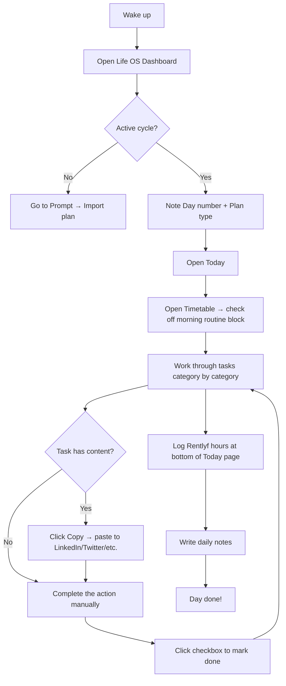
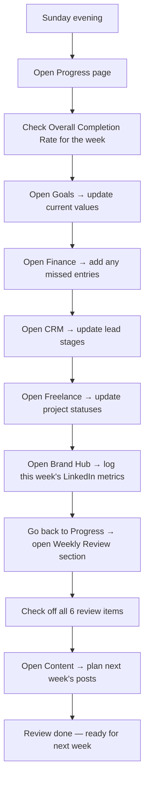
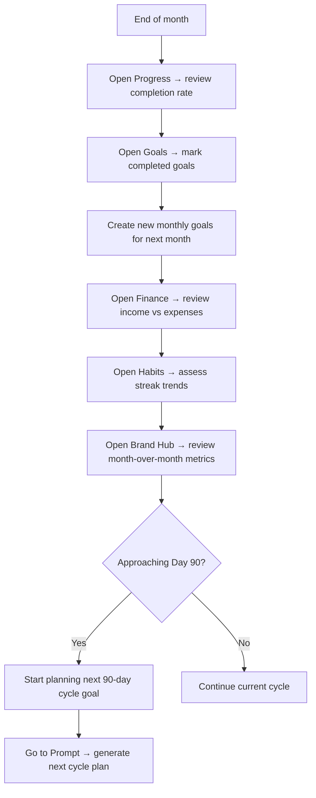
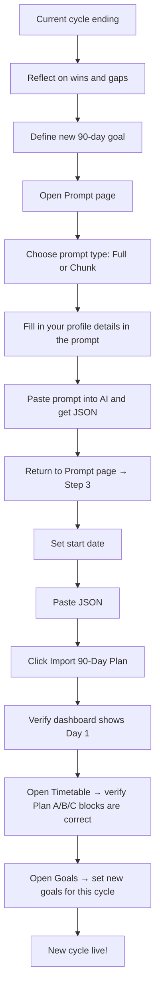

# Life OS — User Guide
### Version 2.0 | July 2026

---

## Table of Contents

- [Part 1 — Getting Started](#part-1--getting-started)
- [Part 2 — Module Guides](#part-2--module-guides)
- [Part 3 — Your 90-Day Plan](#part-3--your-90-day-plan)
- [Part 4 — Workflows](#part-4--workflows)
- [Part 5 — Data and Privacy](#part-5--data-and-privacy)

---

## Part 1 — Getting Started

### What Is Life OS?

Life OS is your personal operating system — a single web application that replaces the dozen tabs you keep open: your Notion to-do list, your habit tracker, your CRM spreadsheet, your content calendar, your finance notebook, and your learning tracker.

The core idea is the **90-day cycle**. Every 90 days you generate a plan with an AI (or write your own), import it, and Life OS shows you exactly what to do each day. At the end of the 90 days, you review, reflect, and start again.

Every module (Goals, Health, Finance, CRM, etc.) is designed to support that 90-day focus — not to be another app you maintain in parallel.

---

### How to Sign Up

1. Open Life OS in your browser and click **Sign up**.
2. Enter your **name**, **email address**, and a password (minimum 8 characters).
3. Click **Create Account**.
4. Check your email for a confirmation link. Click it to activate your account.
5. Return to the app and click **Sign in**.

> If you already have an account, go straight to the sign-in page and enter your email and password.

**Forgot your password?** On the login page, click **Forgot password?**, enter your email, and check your inbox for a reset link.

---

### The Dashboard Overview

After signing in you land on the **Dashboard** (`/`). From top to bottom:

**Today's summary card** — shows your current day number, today's date, which Plan (A, B, or C) is assigned, how many tasks you have done out of the total for today, and a circular progress ring.

**Quick stats row** — four cards:
- Streak (consecutive days where you completed at least half your tasks)
- Cycle progress (Day N / 90)
- This month's income (from Finance entries)
- Exercise days this week (from Health logs)

**This week grid** — seven small boxes, one per day, each with a colour dot showing completion status.

**Quick access** — buttons to jump straight to Health Log, Finance, CRM, and Import Plan.

**90-day heatmap** — a row of 90 thin bars, one per day. Green means you finished 80% or more. Yellow is 50–79%. Red is below 50%. Grey means the day is in the future or has no data.

---

### The Sidebar and Modules

The left sidebar lists all your enabled modules. Click any module name to open it. The currently active module is highlighted in purple.

The modules are (in order):
Dashboard, Today, Calendar, Progress, Timetable, Goals, Health, Finance, CRM, Blog, Content, Learning, Freelance, Rentlyf, Habits, Brand, Prompt, Settings.

If you are the app administrator, you also see **Admin Panel** at the bottom of the list.

The **Life OS v2** label and your display name appear at the very bottom of the sidebar.

---

## Part 2 — Module Guides

### Today

**What it does**: Shows all your tasks for today, grouped by category (LinkedIn, GitHub, health, learning, etc.).

**How to use it**:
1. Open **Today** from the sidebar.
2. You see cards for each category. Each card shows the category name, an emoji, and a count like `2/5`.
3. Click the checkbox next to a task to mark it done. The task gets a strikethrough.
4. If a task has pre-written content (like a LinkedIn post body), you will see a preview and a **Copy** button. Click Copy to copy the text to your clipboard, then paste it wherever you need it.
5. To skip a task, hover over it and click the **Skip** arrow icon. The task is marked [Skipped].
6. To postpone a task, hover and click the forward arrow icon. A small input appears — type the day number you want to move it to and click **Move**.
7. At the bottom: log your **Rentlyf hours** for today (the input syncs automatically to the Rentlyf module).
8. Write in the **Daily Notes** area — it saves automatically as you type.
9. Navigate to yesterday or tomorrow with the chevron links at the very bottom.

**Tips**:
- The "Add Quick Task" button at the bottom of the task list lets you add an ad-hoc task in the `general` category.
- Editing a task (pencil icon on hover) lets you change the title and the content text.

---

### Calendar

**What it does**: Shows a monthly calendar view of your 90-day cycle.

**How to use it**:
- Each calendar cell shows the day number (D42), a colour dot (green/yellow/red), and a task count (3/7).
- Click any cell with data to jump to that day's task view.
- Use the left/right arrows to navigate between months.
- The **Upcoming Days** list below shows the next 7 days with quick access.

---

### Progress

**What it does**: Analytics for your 90-day cycle. Two tabs — **Overview** and **Growth Tracker**.

**Overview tab**:
- Four KPI cards: streak, completed tasks, skipped tasks, pending tasks.
- Overall completion rate progress bar.
- 90-day heatmap (same as dashboard, but bigger and square cells).
- Weekly breakdown for the last 4 weeks (horizontal bars).
- Category breakdown — which categories have the best completion rate.
- Last 14 days detail list.
- **Weekly Review** checklist — 6 items you should do every week (review completion rate, update goals, check CRM, etc.). Check them off here; they reset automatically next week.

**Growth Tracker tab**:
- A table with every past day as a row.
- Columns for LinkedIn, GitHub, Twitter, and Freelance task completion (done/total).
- Click any row to go to that day's view.

---

### Timetable

**What it does**: Manages your three daily schedule templates (Plan A, B, C) and shows your weekly focus rhythm.

**How to use it**:
- **Plan A** — your standard day. Default if no special conditions apply.
- **Plan B** — heavy deep-work day (more focus blocks, less social media).
- **Plan C** — business development day (cold calls, proposals, networking).

**Checking off blocks**: At the top of the Timetable page, you see today's plan with checkboxes. As you complete each time block (morning routine done, deep work session done, etc.), check the box. These are separate from task checkboxes — they track whether you followed your timetable, not whether individual tasks are done.

**Editing blocks**: Hover over any block and click the pencil icon to edit its time, name, activity, duration, and emoji.

**Adding a block**: Click the **+ Add Block** button within a plan section to add a new time block.

**Weekly Rhythm table**: At the bottom of the page, this read-only table shows Monday through Sunday with the suggested focus and plan type for each day.

**Starting a New Cycle**: When your 90 days are complete (or when you want to reset), click **New Cycle**. This deactivates your current cycle and creates a fresh one starting today. You will need to import a new plan via the Prompt page.

---

### Goals

**What it does**: Tracks your goals across four time horizons: Life, Annual, Quarterly, and Monthly.

**How to use it**:
1. Click a tab to view goals of that type.
2. Click **New Goal** to create one.
3. Fill in the title (required). Optionally add: description, status, a numeric target and current value with a unit (for progress bars), and a deadline.
4. Each goal card shows a progress bar if you have set a numeric target.
5. Click the circle icon on a goal to toggle it between completed and in-progress.
6. Hover over a goal to see the Edit (pencil) and Delete (trash) icons.

**Example**: Goal: "Get 10 freelance clients" → Target: 10, Current: 3, Unit: clients → Shows a 30% progress bar.

---

### Health Tracker

**What it does**: Records daily health data.

**How to use it**:
1. Open **Health** from the sidebar.
2. The **Daily Log** form shows today's date (change it if logging a past day).
3. Toggle the checklist buttons for Exercise, Yoga, Meditation, and Skincare.
4. Fill in: Weight (kg), Water glasses, Sleep hours.
5. Drag the Mood slider from 1 (sad) to 5 (great).
6. Add exercise minutes and notes if you exercised.
7. Click **Save Log**.

The form pre-fills automatically if you have already logged today. If you change the date picker, the form shows that day's existing log (or clears for a new one).

**Summary cards** at the top show your 14-day averages for sleep, water, exercise, and meditation.

**History table** at the bottom shows the last 14 logs. Hover over a row to see the Edit and Delete buttons.

---

### Finance Tracker

**What it does**: Tracks income and expenses with a debt countdown.

**How to use it**:

**Adding entries**:
1. Click **Add Entry**.
2. Choose the date, type (Income or Expense), category, amount (in ₹), and an optional description.
3. Click **Save**.

**Debt Countdown**: Enter how much you paid this time in the debt input and click **Log Payment**. It updates your remaining debt and also creates an expense entry automatically.

**To set/change your total debt**: Click the "(edit)" link next to the total debt amount. Type the new total and click Save.

**Summary**: The three cards at the top show total income, total expenses, and net balance across all tracked entries.

**Filtering**: Use the All / Income / Expense buttons to filter the list below.

---

### CRM

**What it does**: Manages your freelance leads pipeline and cold call log.

**Lead stages**: Cold → Warm → Hot → Proposal → Client → Lost.

**How to use it**:
1. Click **Add Lead** and fill in the contact's details.
2. The six stage cards at the top show how many leads are in each stage. Click a stage to filter.
3. Each lead card has an inline stage dropdown — update the stage directly without opening an edit form.
4. Hover over a lead for Edit and Delete buttons.
5. If a follow-up date is past due, you will see an orange "Follow-up overdue" badge.

**Cold Call Log** (below the leads):
1. Click **Log Call** to add a new cold call record.
2. Fill in date, name, phone, and outcome (No Answer, Callback, Interested, Not Interested, Converted).
3. Optionally link to an existing lead — selecting a lead auto-fills the name and phone.

---

### Blog

**What it does**: Manages your blog posts (Hashnode, dev.to, Medium, personal blog).

**Status pipeline**: Idea → Draft → Scheduled → Published.

**How to use it**:
1. Click **New Post** and fill in the title, platform, status, notes/outline, scheduled date, and URL (once published).
2. Filter by status using the pills at the top.
3. Hover over a post for Edit and Delete buttons.
4. Published posts show the URL as a clickable external link.

---

### Content Hub

**What it does**: Plans social media content across LinkedIn, Twitter, Instagram, YouTube, and Newsletter. Has a weekly calendar view.

**How to use it**:
1. Choose a platform tab at the top.
2. The weekly calendar shows Mon–Sun with posts scheduled for each day.
3. Click **New Post** to add a post. Fill in: title, platform, status, content, hook, tags, pillar, scheduled date.
4. Pillar options: Backend Engineering, Startup Life, Building Rentlyf, Learning, Product Thinking, Career Journey, Tech Documentation, Business.
5. Hover over a post card for Edit, Delete, and Copy content buttons.

---

### Learning

**What it does**: Tracks courses, books, tutorials, and other learning resources.

**How to use it**:
1. Click **Add Resource**.
2. Fill in: title, type (course/book/tutorial/documentation/video/podcast/other), topic/skill, status, URL, and optionally total lessons and completed lessons.
3. Resources with `In Progress` status appear in the **Currently Learning** summary at the top with a progress bar.
4. Filter by status using the pills.
5. If you added a URL, you see an "Open resource" external link on the card.

---

### Freelance

**What it does**: Tracks freelance projects from lead to completion.

**Status pipeline**: Lead → Proposal → Active → Completed → Cancelled.

**How to use it**:
1. Click **New Project** and fill in: title, client name, platform (Upwork, Fiverr, LinkedIn, Direct, Referral, Other), status, budget, paid amount, deadline, notes.
2. A green progress bar shows how much of the budget has been paid.
3. Summary cards show total earned from completed projects and active pipeline value.
4. Hover over a project for Edit and Delete buttons.

---

### Rentlyf

**What it does**: Tracks hours you work on the Rentlyf project, grouped by week.

**How to use it**:
1. In the **Log Hours** form, set the date, enter hours (supports 0.5 increments), pick a category (dashboard/development/design/meeting/support/other), and add notes.
2. Click **Log**.
3. The page groups all logs by calendar week showing each week's total hours.

**Note**: Hours logged from the **Today** page also appear here automatically — they are synced to the same table.

---

### Habits Tracker

**What it does**: Tracks daily and weekly habits with a 7-day grid and streak counter.

**How to use it**:
1. Click **Add Habit** and give it a name, emoji, colour, and frequency (daily or weekly).
2. In the table, each row is a habit. The last 7 days are shown as columns.
3. Click any cell to toggle that day's habit done/not done.
4. The **Streak** badge shows your current streak (consecutive days you completed the habit).

---

### Brand Hub

**What it does**: Manages your LinkedIn personal brand — weekly metrics, daily actions, profile checklist, and content pillar tracking.

**How to use it**:

**Daily Actions** (left column):
- Five items to complete every day: comment on 5 founder posts, comment on 5 dev posts, send 3 connection requests, reply to all comments, check analytics.
- Check them off here. They reset the next day.

**Weekly Metrics** (left column):
- Every Monday (or whenever you check), log: followers, connections, profile views, search appearances, post impressions.
- Click **Save Metrics**.
- The follower growth chart updates automatically.

**LinkedIn Profile Checklist** (right column):
- 11 items to complete your profile setup (photo, banner, headline, etc.).
- Check items off as you complete them.

**Content Pillars** (right column):
- 8 pillar tiles each show how many posts you have written for that pillar.
- Click a pillar to go to the Content Hub filtered to that pillar.

---

### Prompt and Import

See Part 3 — Your 90-Day Plan for full instructions on this module.

---

### Settings

**What it does**: Your profile, preferences, finance settings, password, and sign-out.

**Profile section**:
- Edit your display name, bio, LinkedIn URL, GitHub URL, Twitter/X URL, and portfolio URL.
- Click **Save Profile**.

**Preferences section**:
- **Theme**: Dark, Light, or System. Applies immediately when you select it.
- **Timezone**: Select your timezone (default is Asia/Kolkata).
- **Week Starts**: Monday or Sunday.
- **Daily Reminder**: Set a time. (Note: in-app push notifications are not yet active — this is saved for future use.)
- Click **Save Preferences**.

**Finance Configuration**:
- Set your **Total Debt** amount. This is the 100% mark for the debt progress bar in the Finance module.

**Change Password**:
- Enter your new password twice and click **Update Password**.

**Sign Out**:
- Click **Sign Out** to log out from this device.

---

## Part 3 — Your 90-Day Plan

### How the Cycle System Works

Life OS is built around 90-day cycles. A cycle is a 90-day period with a title, a primary goal, a start date, and an end date.

Each of the 90 days has:
- A day number (1–90)
- A plan type (A, B, or C)
- An optional theme or focus
- A list of tasks

Tasks have a category (linkedin, github, freelance, health, etc.), a title, and optionally pre-written content (like a full LinkedIn post body).

Only one cycle is "active" at a time. The dashboard, Today page, and Calendar all show the active cycle.

---

### How to Import Your Plan via the Prompt Page

The recommended workflow is to use an AI (Claude, ChatGPT, Gemini) to generate your 90-day plan as JSON, then import it here.

**Step 1: Copy the prompt**
1. Go to **Prompt** in the sidebar.
2. Choose between:
   - **Full 90-Day** (Claude / Gemini): generates all 90 days in one response.
   - **30-Day Chunk** (ChatGPT): generates 30 days at a time if your AI has output limits.
3. Fill in your details in the bracketed fields in the prompt template, then click **Copy Full Prompt** (or **Copy Days 1–30 Prompt**).

**Step 2: Get JSON from AI**
1. Paste the prompt into Claude, ChatGPT, or your preferred AI. Fill in the [BRACKETED] placeholders first.
2. Wait for the full response. For the full mode, verify you see `day_number: 90` near the end.
3. Copy the entire JSON response (including the triple-backtick fences if present).

**Step 3: Paste and import**
1. Click **Next** twice to reach Step 3.
2. Set your **Cycle Start Date** (today or the date your 90 days should begin).
3. Paste the JSON into the text area.
4. Click **Import 90-Day Plan**.
5. You will see a success animation and be redirected to your dashboard.

> **Warning**: Importing a full plan deactivates your current active cycle and creates a new one. Use this with care.

**For ChatGPT users (chunked import)**:
1. Import days 1–30 first (full mode, no Append Mode).
2. For days 31–60: turn on **Append Mode** toggle, paste the chunk JSON, click **Append Days**.
3. For days 61–90: same — Append Mode on, paste, append.

---

### How Timetable Plans Work (Plan A / B / C)

Each day in your cycle has a plan type: A, B, or C. The plan type determines which timetable template your day follows.

- **Plan A** — your standard productive day (morning routine, deep work, afternoon tasks, evening content).
- **Plan B** — heavy deep-work day (extended focus sessions, minimal social media time).
- **Plan C** — business development day (cold calls, proposals, client meetings, networking).

When you look at your timetable, each plan section shows time blocks: a scheduled time (e.g., "9:00–1:00 PM"), an emoji, a block name, and the activity detail.

Checking off a block on the Timetable page is separate from completing tasks on the Today page. The timetable is about whether you followed your schedule; tasks are about whether you did the specific actions.

The **Weekly Rhythm** table (at the bottom of the Timetable page) shows the suggested plan for each day of the week:
- Monday: Plan A — Techwara + LinkedIn post
- Tuesday: Plan A — Techwara + GitHub push
- Wednesday: Plan C — Cold calling + content batch
- Thursday: Plan B — Techwara + freelance
- Friday: Plan A — Freelance delivery + content
- Saturday: Plan C — Freelance + CRM + proposals
- Sunday: Plan C — Weekly review + planning

---

### How to Start a New Cycle

When your 90 days are complete:
1. Go to **Timetable**.
2. Click **New Cycle** (found in the timetable page header or action area).
3. A new cycle is created with today as Day 1.
4. Go to **Prompt** and import a new 90-day plan.

Alternatively, you can import a new plan via the Prompt page without going to Timetable — the full-import mode automatically deactivates the old cycle.

---

## Part 4 — Workflows

### Morning Routine

### Weekly Review (Every Sunday)

### Monthly Cycle Review

### New 90-Day Cycle Setup

---

## Part 5 — Data and Privacy

### Where Your Data Is Stored

All Life OS data is stored in a **Supabase** PostgreSQL database. Supabase is a cloud-hosted open-source platform running on AWS infrastructure.

Your data is associated with your user account and is **completely isolated** from every other user. This is enforced by a security mechanism called **Row Level Security (RLS)** — a database-level policy that prevents any query from reading or modifying rows that belong to another user, even if the application code had a bug.

The application never uses a server-level admin key on the client side. The only place the admin key is used is in a single server-side route (`/api/admin/users`) that requires you to be the super_admin.

### What Data Is Stored

Every entry you make — tasks, health logs, finance entries, goals, habits, content posts, CRM leads, freelance projects, learning resources, Rentlyf hours, brand metrics — is stored in your Supabase account's PostgreSQL database under your unique user ID.

### Export and Backup Options

Go to **Settings → Your Data → Export My Data** to download every table you own (tasks, goals, health, finance, CRM, habits, brand, and everything else) as a single JSON file. The export runs entirely in your browser — it queries Supabase directly with your own session and triggers a file download; nothing is sent to a third-party server.

For a raw database-level backup instead, you can still:
1. Log in to your Supabase project dashboard at `https://app.supabase.com`.
2. Go to **Table Editor** and browse each table, or use the **CSV export** button available on each table view.
3. Or use the Supabase CLI / PostgreSQL tools to perform a full database dump.

### Admin Panel (Super Admin Only)

The Admin Panel (`/admin`) is only visible and accessible to the user whose `user_profiles.role` is `super_admin`. This check happens both at the server (middleware) and the client level, reading the same database column both times.

The Admin Panel allows:
- Viewing all registered users with their display names and emails.
- Enabling or disabling specific modules per user.
- Bulk-enabling all modules for a user with one click.
- Bulk operations across multiple selected users.

Emails in the Admin Panel are retrieved using the Supabase service role key (a server-side-only secret). The key is never sent to the browser.

### Deleting Your Account

There is currently no in-app account deletion flow. `[NEEDS CLARIFICATION: account deletion not yet implemented]`

To delete your account, go to your Supabase project → **Authentication → Users**, find your user, and delete it. Deleting the auth user will remove the account. Whether this cascades to delete all related data depends on whether `ON DELETE CASCADE` is set on the foreign keys in your Supabase schema.
