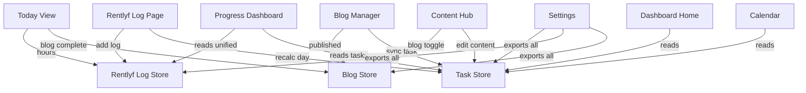

# Growth Tracker — Complete Connection Audit & Architecture Guide

## 🔗 Page-by-Page Data Connection Map

Every page and what store it reads/writes. **All connections verified ✅**

| Page | Reads From | Writes To | Sync Hooks | Charts |
|------|-----------|-----------|------------|--------|
| **Dashboard Home** `/` | `useTaskStore` | — (read only) | — | Progress ring, 90-day heatmap |
| **Today View** `/today` | `useTaskStore` | `useTaskStore`, `useRentlyfStore`, `useBlogStore` | [useSyncRentlyfHours](file:///d:/Techwara/MyHelpingHand/src/hooks/use-sync.ts#8-45), [useSyncBlogStatus](file:///d:/Techwara/MyHelpingHand/src/hooks/use-sync.ts#71-104) | Progress ring |
| **Day View** `/day/[n]` | Same as Today | Same as Today | Same as Today | Same as Today |
| **Calendar** `/calendar` | `useTaskStore` | — (read only) | — | Monthly grids |
| **Content Hub** `/content` | `useTaskStore` | `useTaskStore`, `useBlogStore` | [useSyncBlogStatus](file:///d:/Techwara/MyHelpingHand/src/hooks/use-sync.ts#71-104) | — |
| **Progress** `/progress` | `useTaskStore`, `useRentlyfStore` | — (read only) | [useUnifiedRentlyfStats](file:///d:/Techwara/MyHelpingHand/src/hooks/use-sync.ts#136-170) | AreaChart, BarChart, table |
| **Blog Manager** `/blog` | `useBlogStore` | `useBlogStore`, `useTaskStore` | [useSyncBlogToTask](file:///d:/Techwara/MyHelpingHand/src/hooks/use-sync.ts#105-135) | — |
| **Freelance** `/freelance` | `useFreelanceStore` | `useFreelanceStore` | — | — |
| **Rentlyf Log** `/rentlyf` | `useRentlyfStore`, `useTaskStore` | `useRentlyfStore`, `useTaskStore` | [useSyncRentlyfLogToDay](file:///d:/Techwara/MyHelpingHand/src/hooks/use-sync.ts#46-70), [useUnifiedRentlyfStats](file:///d:/Techwara/MyHelpingHand/src/hooks/use-sync.ts#136-170) | BarChart, PieChart |
| **Goals** `/goals` | `useGoalsStore` | `useGoalsStore` | — | — |
| **Timetable** `/timetable` | static `data/` files | — | — | — |
| **Learning** `/learning` | `useLearningStore` | `useLearningStore` | — | — |
| **Settings** `/settings` | ALL stores | ALL stores (reset/export) | — | — |
| **TopBar** (layout) | `useTaskStore` | — (read only) | — | — |
| **Sidebar** (layout) | — (static) | — | — | — |

---

## 🔄 Sync Flow Diagram

---

## 📊 Chart Data Sources (All Verified)

| Chart | Page | Data Source | Synced? |
|-------|------|-----------|---------|
| Today progress ring | Today/Dashboard | `useTaskStore` → day.tasks | ✅ |
| 90-day heatmap | Dashboard | `useTaskStore` → all days | ✅ |
| Daily completion area chart | Progress | `useTaskStore` → completion % | ✅ |
| Coding hours bar chart | Progress | [useUnifiedRentlyfStats](file:///d:/Techwara/MyHelpingHand/src/hooks/use-sync.ts#136-170) (both stores) | ✅ |
| KPI cards (LinkedIn/GitHub/etc) | Progress | `useTaskStore` → task completions | ✅ |
| KPI card (Rentlyf Hours) | Progress | [useUnifiedRentlyfStats](file:///d:/Techwara/MyHelpingHand/src/hooks/use-sync.ts#136-170) | ✅ |
| Platform breakdown table | Progress | `useTaskStore` → category counts | ✅ |
| Weekly coding hours bar chart | Rentlyf | [useUnifiedRentlyfStats](file:///d:/Techwara/MyHelpingHand/src/hooks/use-sync.ts#136-170) | ✅ |
| Category pie chart | Rentlyf | [useUnifiedRentlyfStats](file:///d:/Techwara/MyHelpingHand/src/hooks/use-sync.ts#136-170) | ✅ |
| Calendar monthly grids | Calendar | `useTaskStore` → day completion | ✅ |

---

## 🔍 Bug Found & Fixed

**Content Hub blog sync was missing.** When you clicked "Mark Posted" on a blog post in Content Hub, it only updated `useTaskStore` but NOT `useBlogStore` — so the Blog Manager Kanban wouldn't reflect the change. **Fixed** by adding [useSyncBlogStatus](file:///d:/Techwara/MyHelpingHand/src/hooks/use-sync.ts#71-104) to Content Hub.

---

## 💾 localStorage — How It Works

### Does data erase when you close the browser?

**NO! localStorage persists permanently.** Here's the full behavior:

| Action | Data Status |
|--------|-------------|
| Close browser tab | ✅ Data stays |
| Close browser completely | ✅ Data stays |
| Restart computer | ✅ Data stays |
| Open same URL tomorrow | ✅ Data stays |
| Keep it for months | ✅ Data stays |
| Clear browser cache | ⚠️ **Data deleted** |
| Clear cookies & site data | ⚠️ **Data deleted** |
| Use incognito/private mode | ❌ Data lost on close |
| Use a different browser | ❌ Different data |
| Use a different computer | ❌ Different data |
| Reinstall browser | ❌ Data lost |

### Pros of localStorage

| Pro | Detail |
|-----|--------|
| ✅ No backend needed | Zero cost to run |
| ✅ Instant | No network latency |
| ✅ Works offline | No internet required |
| ✅ Privacy | Your data stays on YOUR device |
| ✅ Simple | No database, no auth, no server |

### Cons of localStorage

| Con | Detail |
|-----|--------|
| ⚠️ 5-10 MB limit | Enough for this app, but limited |
| ⚠️ Single device | Can't sync between phone and laptop |
| ⚠️ Can be cleared | Browser cache clear = data gone |
| ⚠️ No backup | Unless you manually export |
| ⚠️ Browser-specific | Chrome data ≠ Firefox data |

### Mitigation (What We Already Built)

- **Export Report (Markdown)** — readable backup of all progress
- **Export Backup (JSON)** — full data backup that can be re-imported
- **Import Data** — restore from a JSON backup

---

## 🚀 Should You Deploy It?

**YES! Push to GitHub and deploy on Vercel.** Here's why and how:

### Deployment Plan

1. **Push to GitHub** — `git init` → `git add .` → `git commit` → push to `github.com/PrajjawalSingh1997/MyHelpingHand`
2. **Deploy on Vercel** — connect your GitHub repo → Vercel auto-deploys Next.js apps in ~2 minutes → you get a free URL like `myhelpinghand.vercel.app`
3. **Use from anywhere** — open on phone, laptop, any browser

### Important: Data Is Still Per-Device

Even after deploying, localStorage is per-browser-per-device. If you use it on:
- Chrome on your laptop → Data A
- Chrome on your phone → Data B (separate)

### Want Cross-Device Sync Later?

If you want the same data on all devices, you'd need to add a simple backend. Options:
1. **Supabase** (free tier) — easiest, 500 MB PostgreSQL database
2. **Firebase** (free tier) — Google's BaaS
3. **Your own Rentlyf backend** — you already have Express + Prisma

But for now, **localhost + Vercel deployment is perfect** for personal use on one device.
